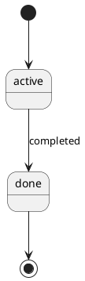

# Project Starter

A documentation-first template for AI-assisted development. Define what you're building before
an AI agent (Claude Code, etc.) starts writing code — then keep every doc in sync automatically
as work progresses.

This repo is a **pure template repository**. It contains no real project content — only blank
scaffolding under `templates/`. Copy `templates/` into a new project's `docs/` folder to start.

---

## How it works

1. **`AGENTS.md`** defines the rules an AI agent follows: which docs to create, when to update
   them, and what to do when a task or module completes.
2. **`templates/`** holds the blank scaffolding — every document the agent will fill in.
3. As work happens, the agent keeps `docs/` (in your actual project) in sync with what was built,
   following the checklist in `AGENTS.md`.

```
project_starter/                     ← this repo (template only)
├── AGENTS.md
├── orchestrator.py                  ← workflow manager: writes .ai/WORKFLOW.md + calls build-context.py
├── build-context.py                 ← context builder: writes .ai/AI_CONTEXT.md from registry
├── workflow-registry.yaml           ← task_type → validator sequence mapping
├── document-registry.yaml           ← single source of truth for all document metadata
├── .gitignore                       ← excludes .ai/ (generated, not committed)
├── debug-instrumentation-rules.md
├── code-quality-check.md            ← code review checklist for retrofitting existing projects
├── .ai/                             ← generated context (gitignored); recreate with orchestrator.py
│   ├── AI_CONTEXT.md               ← ordered read list for the current task
│   └── WORKFLOW.md                 ← deterministic workflow plan (pre-task, validators, closeout)
├── adapters/                        ← agent adapter layer (translate WORKFLOW.md to each tool's native format)
│   ├── claude/
│   │   ├── start-task.md           ← slash command template (copy to .claude/commands/ in your project)
│   │   └── stop-hook.sh            ← writes task-log row on Claude Code session end
│   ├── codex/
│   │   ├── setup.md                ← Codex setup instructions with orchestrator quickstart
│   │   └── task-instructions.md    ← task instructions template; WORKFLOW.md injected at render time
│   └── cursor/
│       └── .cursorrules            ← Cursor rules template; WORKFLOW.md injected at render time
├── docs/                            ← framework design documents (not copied to projects)
│   ├── architecture-analysis.md    ← current coupling problems + responsibility boundaries
│   ├── refactoring-plan.md         ← 3-phase migration plan (registry → context builder → orchestrator)
│   └── context-builder-design.md   ← build-context.py design: inputs, outputs, algorithm
├── guidance/
│   ├── document-purposes.md         ← index: type → per-type file lookup
│   ├── document-purposes-common.md  ← applies to all project types
│   ├── document-purposes-web-app.md
│   ├── document-purposes-cli-tool.md
│   ├── document-purposes-library.md
│   ├── document-purposes-data-pipeline.md
│   ├── document-purposes-ml-pipeline.md
│   ├── document-purposes-microservices.md
│   ├── document-purposes-llm-app.md
│   ├── document-purposes-iac.md
│   └── document-purposes-mobile-app.md
└── templates/
    ├── project-requirements.md      ← project scope, goals, edge cases, acceptance criteria
    ├── project-plan.md              ← sprint/task breakdown per feature
    ├── current-state.md             ← the active task
    ├── sprint-sync.md               ← sprint-end Document Update Checklist (load only at sprint end)
    ├── changelog.md                 ← completed task history
    ├── task-log.md                  ← task verification log (AI writes one row per completed task)
    ├── sprint-change-log.md         ← implementation changes this sprint (doc sync deferred to sprint end)
    ├── codebase-map.md              ← package vs. custom code, by layer; includes project tree
    │
    ├── init/                        ← per-type project initialization sequences (load only the one that matches)
    │   ├── web-app.md
    │   ├── cli-tool.md
    │   ├── library.md
    │   ├── data-pipeline.md
    │   ├── ml-pipeline.md
    │   ├── microservices.md
    │   ├── llm-app.md
    │   ├── iac.md
    │   ├── mobile-app.md
    │   ├── document-matrix.md       ← Required/Optional/N/A table per project type (load only when initializing)
    │   └── retrofit.md              ← Step-by-step retrofit procedure for existing codebases
    │
    ├── specs/
    │   │                              ── Universal (all project types) ──
    │   ├── quickstart.md            ← setup steps, prerequisites, local startup, verification
    │   ├── research.md              ← technology decisions + alternatives considered (excluded from PDF until filled)
    │   ├── glossary.md              ← business terms, technical terms, abbreviations
    │   ├── dependencies.md          ← runtime packages, dev packages, external services, infrastructure
    │   ├── test-plan.md             ← testing strategy, scope, environment, CI integration
    │   └── test-report.md           ← test results, pass/fail summary, coverage, known issues
    │   │                              ── Web App / Microservices ──
    │   ├── data-model.md            ← schema, indexes, state machines, migrations
    │   ├── api-contract.md          ← endpoints, events, validation rules, error codes (REST + WebSocket + GraphQL + gRPC)
    │   ├── permissions.md           ← roles, permission matrix, endpoint access control
    │   ├── logging-spec.md          ← logging rules, logger instantiation, module naming
    │   │                              ── CLI Tool ──
    │   ├── cli-contract.md          ← subcommands, flags, exit codes, stdin/stdout contract
    │   ├── release-guide.md         ← versioning policy, publish checklist, deprecation policy
    │   ├── compatibility-matrix.md  ← supported runtime versions, peer deps, known incompatibilities
    │   │                              ── Library / SDK ──
    │   ├── public-api.md            ← public functions/classes/types, stability tiers, deprecation log
    │   ├── release-guide.md         ← (same template as CLI Tool)
    │   ├── compatibility-matrix.md  ← (same template as CLI Tool)
    │   │                              ── Data Pipeline / ML Pipeline ──
    │   ├── pipeline-contract.md     ← inter-stage input/output contracts, cross-stage consistency check
    │   ├── data-model.md            ← schema, indexes (shared with Web App template)
    │   ├── logging-spec.md          ← (shared with Web App template)
    │   │                              ── ML Pipeline (additional) ──
    │   ├── model-contract.md        ← model input/output schema, production thresholds, retraining policy
    │   └── experiment-log.md        ← per-run experiment record (hypothesis → config → results → decision)
    │   │                              ── Microservices (additional) ──
    │   ├── service-catalog.md       ← all services: owner, port, URL, dependencies, events
    │   └── service-contract.md      ← inter-service REST contracts and event schemas
    │   │                              ── AI / LLM Application ──
    │   ├── llm-contract.md          ← model, system prompt, parameters, tool schemas, retry strategy
    │   ├── prompt-library.md        ← index only: prompt list + naming rules (no prompt content here)
    │   ├── prompts/
    │   │   └── [prompt-id]-prompt.md ← one file per prompt: template, variables, examples, version history
    │   ├── eval-spec.md             ← LLM-as-a-judge criteria, rubric, fixed test case set (stable config)
    │   ├── eval-log.md              ← append-only eval run results (load only when comparing versions)
    │   ├── rag-contract.md          ← retrieval sources, chunking, embedding model, vector store (optional)
    │   └── mcp-contract.md          ← MCP server connections, tool schemas, tool-use policy (optional)
    │
    ├── architecture/
    │   ├── architecture.md          ← components, data flow, structured YAML for diagram (all types)
    │   ├── backend.md               ← backend stack, layering, module pattern (not for Library / SDK)
    │   ├── frontend.md              ← frontend stack, page structure, component strategy (Web App / Microservices only)
    │   ├── database.md              ← entities/relationships (conceptual level; not for CLI / Library)
    │   ├── deployment.md            ← services, env vars, startup flow (Web App / Pipeline / Microservices)
    │   └── distribution.md          ← build, publish, install instructions (CLI Tool / Library / SDK)
    │
    ├── business/
    │   ├── business-process.md      ← index + rules for business process files (per process)
    │   ├── business-objects.md      ← index + rules for business object files (per object)
    │   └── business-rules.md        ← approval/validation/notification/audit rules
    │
    ├── flows/
    │   ├── module-data-flow-v2.md   ← index + rules for module flow files (Feature / Background Job / Pipeline Stage / Shared Utility)
    │   └── module-flow-v2.md        ← index + rules for cross-module sequence files (per module)
    │
    └── script/
        ├── validators/              ← shipped to user projects (docs/script/validators/)
        │   ├── verify_docs.py       ← document completeness + fill quality audit
        │   ├── verify_logs.py       ← log format + trace_id documentation audit
        │   ├── verify_tests.py      ← test-report.md fill quality audit
        │   ├── verify_module_docs.py ← module flow coverage + quality audit
        │   ├── verify_content.py    ← full document content quality gate (all Required docs × project type)
        │   ├── _verify_common.py    ← shared placeholder patterns imported by verify scripts
        │   └── _registry.py         ← document registry loader
        ├── generators/              ← shipped to user projects (docs/script/generators/)
        │   ├── build_pdf.py         ← renders all ```plantuml blocks via PlantUML + merges docs/ into PDF
        │   ├── pdf_allowlist.py     ← single source of truth for which files appear in the PDF
        │   ├── plantuml.cfg         ← PlantUML renderer configuration
        │   ├── plantuml.jar         ← download separately (see Setting up PlantUML)
        │   ├── diagnose_spec.py     ← classifies spec fill gaps; triggers framework fix PRs
        │   └── propose_framework_fix.py ← opens a PR on project_starter_v4 to add a missing template section
        ├── scanners/                ← shipped to user projects (docs/script/scanners/)
        │   └── scan_codebase.py     ← scans src/ and reports which modules are undocumented
        └── framework/               ← framework-internal only — NOT copied to user projects
            └── verify_framework.py  ← framework internal consistency audit (run in framework repo)
```

When a new project starts, `templates/` is copied in and becomes `docs/` — see
[Project Initialization](#project-initialization) below.

> **Note on file naming:** flow templates in `templates/flows/` carry a version suffix (e.g. `module-data-flow-v2.md`)
> for internal framework versioning; other templates do not. When copying any template into a new project's `docs/`,
> drop the version suffix — use the base filename (e.g. `[module]-module-data-flow.md`).

---

## Project Initialization

A new project does **not** keep `templates/` — it copies only the files its project type needs
into `docs/`, filling in the placeholders as it goes. The document matrix in `templates/init/document-matrix.md` defines
which files are required, optional, or N/A for each type.

The root files are the same for every type:

```
new_project/
├── AGENTS.md                        ← declare Project Type at the top
├── orchestrator.py                  ← workflow manager: writes .ai/WORKFLOW.md + context
├── build-context.py                 ← context builder (called internally by orchestrator.py)
├── workflow-registry.yaml           ← task_type → validator sequence mapping
├── debug-instrumentation-rules.md
├── code-quality-check.md
├── guidance/
│   ├── document-purposes.md         ← index: maps project type → per-type file
│   ├── document-purposes-common.md  ← loaded by all types
│   └── document-purposes-<type>.md  ← loaded for your declared type (e.g. document-purposes-web-app.md)
└── docs/
    ├── project-requirements.md
    ├── project-plan.md
    ├── current-state.md
    ├── changelog.md
    ├── task-log.md
    ├── sprint-change-log.md
    ├── codebase-map.md
    ├── specs/ architecture/ modules/ script/{validators,generators,scanners}/    ← vary by type (see below)
```

> **Note:** `adapters/` stays in the framework repo — it is **not** copied to user projects.
> The adapter output (`.claude/commands/start-task.md`, `.codex/`, `.cursorrules`) is generated
> into your project by running `orchestrator.py --adapter <tool>`.

The `docs/specs/`, `docs/architecture/`, and `docs/modules/` contents differ per project type:

### Web App

```
docs/specs/
├── research.md  quickstart.md  data-model.md  api-contract.md
├── permissions.md  logging-spec.md
docs/architecture/
├── architecture.md  backend.md  database.md  deployment.md
└── frontend.md                                              ← optional
docs/business/
├── business-process.md  ← index
├── [process-name]-process.md                               ← one per process
├── business-objects.md  ← index
├── [object-name]-object.md                                 ← one per object
└── business-rules.md
docs/modules/
├── module-data-flow.md  module-flow.md                     ← index files
└── [module-name]/
    ├── [module]-module-data-flow.md
    └── log-[module].md
```

### CLI Tool

```
docs/specs/
├── research.md  quickstart.md  cli-contract.md
├── release-guide.md  logging-spec.md
└── compatibility-matrix.md                                 ← optional
docs/architecture/
└── architecture.md  backend.md  distribution.md
docs/modules/
├── module-data-flow.md  module-flow.md                     ← index files
└── [module-name]/
    └── [module]-module-data-flow.md
```

### Library / SDK

```
docs/specs/
├── research.md  quickstart.md  public-api.md
└── release-guide.md  compatibility-matrix.md
docs/architecture/
└── architecture.md  distribution.md                        ← architecture.md optional
docs/modules/
├── module-data-flow.md  module-flow.md
└── [module-name]/
    └── [module]-module-data-flow.md
```

### Data Pipeline

```
docs/specs/
├── research.md  quickstart.md  pipeline-contract.md
├── data-model.md  logging-spec.md  pipeline-debug.md
docs/architecture/
└── architecture.md  backend.md  database.md  deployment.md
docs/modules/
├── module-data-flow.md  module-flow.md                     ← index files
└── [stage-name]/                                           ← one per Pipeline Stage
    └── [stage]-module-data-flow.md
```

### ML Pipeline

```
docs/specs/
├── research.md  quickstart.md  pipeline-contract.md
├── data-model.md  model-contract.md  experiment-log.md  logging-spec.md  pipeline-debug.md
docs/architecture/
└── architecture.md  backend.md  database.md  deployment.md
docs/modules/
├── module-data-flow.md  module-flow.md
└── [stage-name]/
    └── [stage]-module-data-flow.md
```

### Microservices

Each service has its own `docs/` following the Web App structure above.
At the system level, add:

```
docs/specs/
├── service-catalog.md                                      ← all services: owner, port, deps
└── service-contract.md                                     ← inter-service REST + event schemas
docs/architecture/
├── architecture.md                                         ← system-level component diagram
└── deployment.md                                           ← cross-service deployment topology
```

### AI / LLM Application

```
docs/specs/
├── research.md  quickstart.md  llm-contract.md  logging-spec.md
├── llm-debug.md
├── prompt-library.md                                       ← index only
├── prompts/
│   └── [prompt-id]-prompt.md                              ← one per prompt
├── eval-spec.md                                            ← judge config + criteria + test cases
├── eval-log.md                                             ← append-only run results
├── rag-contract.md                                         ← optional, if using RAG
└── mcp-contract.md                                         ← optional, if connecting MCP servers
docs/architecture/
└── architecture.md
docs/modules/
├── module-data-flow.md  module-flow.md
└── [module-name]/
    └── [module]-module-data-flow.md
```

### Mixed / Hybrid Project Types

Some projects span more than one type. Declare both using `+` in `AGENTS.md` and take the union
of their required documents — everything goes in the same `docs/` folder.

```
Project Type: Data Pipeline + Web App
```

`AGENTS.md` drives initialization — declare the project type at the top, then load only the matching
`templates/init/[type].md` file. Each init file contains the full step-by-step sequence for that type.
For hybrid types and common combinations, see `AGENTS.md § Mixed / Hybrid Project Types`.

---

## Working on an existing project

See `AGENTS.md → Startup sequence` for the full startup and task-completion protocol.

---

## Context Builder

`build-context.py` generates `.ai/AI_CONTEXT.md` — a deterministic read list for the current
task. AI tools read this file instead of inferring context from scratch on every startup.

```bash
# Generate context for the current task:
python3 build-context.py

# Override task type (sprint-end shows all Required docs):
python3 build-context.py --task-type sprint-end

# Preview without writing:
python3 build-context.py --dry-run
```

**Inputs:**

| Source | Field | Used for |
|---|---|---|
| `.project-starter.yml` | `project_type` | Registry lookup → required documents |
| `.project-starter.yml` | `task_type` (optional) | Filter to task-relevant documents |
| `docs/current-state.md` | `Task Type:` field (optional) | Override task_type per task |
| `document-registry.yaml` | `context_priority`, `purpose` | Sort and annotate output |

**Output — `.ai/AI_CONTEXT.md`:**

```markdown
# AI Context — data-pipeline / pipeline-stage
Generated: 2026-07-18T10:00:00

## Read (Required)
- docs/current-state.md   # Active task: goal, steps, and required context
- docs/specs/pipeline-contract.md   # Inter-stage input/output contracts

## Read (If Present)
- docs/specs/pipeline-debug.md   # Stage failure diagnosis guide

## Skip
- docs/changelog.md
- docs/specs/test-report.md
```

`.ai/` is gitignored — generated context is not committed. Regenerate it whenever the task changes.

**Task types:** `feature` · `pipeline-stage` · `bug-fix` · `sprint-end` · `eval-run` · `iac-change`

See `docs/context-builder-design.md` for the full algorithm and token reduction analysis.

---

## Orchestrator

`orchestrator.py` is the single entry point for starting work on a task. It selects the correct
validator sequence, writes `.ai/WORKFLOW.md`, and calls `build-context.py` internally — so context
and workflow always reflect the same project type and task type.

```bash
# Generate workflow plan + context for the current task:
python3 orchestrator.py

# Override task type:
python3 orchestrator.py --task-type sprint-end

# Preview WORKFLOW.md without writing:
python3 orchestrator.py --dry-run
```

**Inputs:**

| Source | Field | Used for |
|---|---|---|
| `.project-starter.yml` | `project_type` | Select validator commands + context |
| `.project-starter.yml` | `task_type` (optional) | Select workflow template |
| `docs/current-state.md` | `Task Type:` field (optional) | Override task_type per task |
| `workflow-registry.yaml` | `workflows[task_type].validators` | Ordered post-task validator sequence |

**Output — `.ai/WORKFLOW.md`:**

```markdown
# Workflow Plan — pipeline-stage / data-pipeline
Generated: 2026-07-18T10:00:00

## Pre-task
1. Run `python3 orchestrator.py` → read `.ai/AI_CONTEXT.md` and `.ai/WORKFLOW.md`

## Implementation
- Follow Steps in `docs/current-state.md`

## Post-task validators (run in order)
1. `python3 docs/script/validators/verify_docs.py --project-type data-pipeline --content`
2. `python3 docs/script/validators/verify_logs.py --project-type data-pipeline --strict`
3. `python3 docs/script/validators/verify_content.py --project-type data-pipeline --strict`

## Closeout
- Follow Closeout section in `docs/current-state.md`
```

**Architecture:** `orchestrator.py` selects the workflow template; validators handle execution.
No validator logic lives in the orchestrator — separation of concerns is strictly maintained.

**`workflow-registry.yaml`** maps each task type to an ordered validator list. Add a new entry
when a new task type is introduced; update an existing entry when the validator set changes.

---

## Agent Adapters

The orchestrator produces a tool-agnostic `.ai/WORKFLOW.md`. Adapters translate that output into
each AI tool's native instruction format so developers do not need to wire up the orchestrator manually.

```
orchestrator.py --adapter [claude|codex|cursor]
        │
        ├── writes  .ai/WORKFLOW.md          (always)
        │
        ├── claude  → .claude/commands/start-task.md   (slash command with WORKFLOW.md injected)
        ├── codex   → .codex/setup.md
        │             .codex/task-instructions.md       (WORKFLOW.md injected)
        └── cursor  → .cursorrules                      (WORKFLOW.md injected)
```

**Constraint:** adapters contain only format translation. Document selection logic stays in
`document-registry.yaml` and `orchestrator.py` exclusively — any adapter that duplicates selection
logic is a bug.

### Usage

```bash
# Generate workflow + render Claude Code slash command:
python3 orchestrator.py --adapter claude

# Preview without writing any files:
python3 orchestrator.py --adapter claude --dry-run

# Codex or Cursor:
python3 orchestrator.py --adapter codex
python3 orchestrator.py --adapter cursor
```

### Per-tool setup

**Claude Code**

1. Run `python3 orchestrator.py --adapter claude` — this writes `.claude/commands/start-task.md`.
2. In any future session, type `/start-task` to have Claude run the orchestrator and walk through
   the current workflow plan.
3. (Optional) Install the Stop hook so each session end is logged to `docs/task-log.md`:
   add `adapters/claude/stop-hook.sh` to the `Stop` hook list in `.claude/settings.json`.

**Codex**

1. Run `python3 orchestrator.py --adapter codex` — this writes `.codex/setup.md` and
   `.codex/task-instructions.md`.
2. Codex reads `.codex/setup.md` on startup; `.codex/task-instructions.md` contains the current
   workflow steps with the WORKFLOW.md snapshot injected.
3. Re-run `--adapter codex` whenever the task or task type changes.

**Cursor**

1. Run `python3 orchestrator.py --adapter cursor` — this writes `.cursorrules` at the project root.
2. Cursor picks up `.cursorrules` automatically; the workflow snapshot is injected into the rules.
3. Re-run `--adapter cursor` whenever the task changes.

---

## Retrofitting an existing project

If a project already has code but no documentation, use the retrofit flow in `templates/init/retrofit.md`.
The flow follows Steps 1, 1b, 1c, 2, 3, 4, and 5:

- **Step 1** — Read the codebase (entry point, schema, one complete module)
- **Step 1b** — Run the module inventory scan — `scan_codebase.py` lists every source folder and flags
  undocumented ones. Confirm the list before any documentation is written
- **Step 1c** — Code Quality Check — run `code-quality-check.md` and produce a report covering
  layering, Package First violations, naming, schema design, security, and error handling
- **Step 2** — Fill in architecture and spec documents — describe what actually exists, not what should
  exist. Use your actual layer names, not assumed patterns
- **Step 3** — Fill in module flow files — one module at a time, following the confirmed inventory
- **Step 4** — Fill in project status — reconstruct requirements, mark existing modules as completed
- **Step 5** — Generate the PDF

`code-quality-check.md` can also be used independently at any time as a standalone code review checklist.

---

## Module types

`module-data-flow.md` supports four flow-file formats: **Feature**, **Background Job**, **Pipeline Stage**, and **Shared Utility**.

See `templates/flows/module-data-flow-v2.md → Module Types` for the full description, entry-point rules, and Background Job vs Pipeline Stage disambiguation.

`scan_codebase.py --project-type` uses type-specific scan labels (Command for CLI Tool, Namespace for Library / SDK, Service for Microservices) as vocabulary — these are classification labels, not separate flow formats. All three use the Feature or Shared Utility flow format in their module flow files.

---

## Diagrams

Two tools generate diagrams from Markdown — each outputs both an **interactive HTML**
(drag, zoom, click) and a **static SVG** (for PDF embedding). `build_pdf.py` automatically
appends a type suffix to output filenames to avoid collisions (e.g. `data-model-state.html`).

| Tool | Input | Diagram type | Where it's embedded |
|---|---|---|---|
| `build_pdf.py` (via PlantUML) | Any ` ```plantuml ` block in any `.md` | All UML types | Wherever the block appears in the PDF |
| `schema_to_html.py` | Prisma / SQL file | ERD | `specs/data-model.md` |

> **Multiple blocks per file:** `build_pdf.py` supports multiple diagram blocks in a
> single `.md` file. Each block generates its own HTML + SVG pair, named by its `title:`
> slug (e.g. `data-model-workorder-status-state.html`). A file with a single block keeps
> the original naming behaviour.

> **Diagram placement markers:** to control where a diagram appears in the PDF, add
> `<!-- diagram: KEY -->` at the desired location in the target document (where `KEY` is
> the HTML filename without extension and suffix, e.g. `<!-- diagram: architecture -->`).
> Without a marker, diagrams are appended to the end of their target section.

```bash
# All PlantUML diagrams are rendered automatically when you run:
python3 docs/script/generators/build_pdf.py docs --lang en -o docs/project-documentation-en.pdf

# ERD only (schema_to_html.py is still used for the database diagram):
python3 docs/script/schema_to_html.py path/to/schema.prisma -o docs/specs/schema.html
```

---

## Module inventory scan

Before documenting an existing codebase, run the inventory scan to get an objective view of
what exists and what is already documented:

```bash
# Show tree view + coverage report (auto-detects module type from folder names)
python3 docs/script/scanners/scan_codebase.py src

# Explicit project type — uses correct vocabulary (Feature / Pipeline Stage / Command / Namespace / Service)
python3 docs/script/scanners/scan_codebase.py src --project-type data-pipeline
python3 docs/script/scanners/scan_codebase.py src --project-type web-app
python3 docs/script/scanners/scan_codebase.py src --project-type cli-tool
# Valid values: web-app | cli-tool | library | data-pipeline | ml-pipeline | microservices | llm-app | iac | mobile-app

# Scan N levels deep — for monorepos or Microservices with per-service src/ folders
python3 docs/script/scanners/scan_codebase.py services --project-type microservices --depth 2

# Machine-readable JSON output (for agent consumption)
python3 docs/script/scanners/scan_codebase.py src --project-type web-app --format json

# Auto-generate stub module-data-flow.md files for undocumented modules (skips existing files)
python3 docs/script/scanners/scan_codebase.py src --project-type web-app --scaffold

# Update the Project Structure and Coverage Summary sections in codebase-map.md automatically
python3 docs/script/scanners/scan_codebase.py src --project-type web-app --update docs/codebase-map.md
```

The scan detects folder names to classify folders by module type. Pass `--project-type` to
use the correct vocabulary for your project (e.g. Pipeline Stage for data pipelines,
Command for CLI tools, Namespace for libraries, Service for microservices).

For Data Pipeline and ML Pipeline projects, directories containing `*_stage.py`, `step_*.py`,
or `run_*.py` are labelled `Pipeline Stage (detected)` — giving higher confidence than
name-based classification alone.

Re-run at the end of Step 3 (retrofit) to confirm full coverage.

---

## Document completeness audit

After initializing or retrofitting a project, verify that all Required documents for the
declared type exist in `docs/`:

```bash
# Check completeness for a single project type
python3 docs/script/validators/verify_docs.py --project-type web-app

# Hybrid project — takes the union of both type matrices
python3 docs/script/validators/verify_docs.py --project-type data-pipeline+web-app

# Exit with code 1 if any Required document is missing (for CI or pre-merge checks)
python3 docs/script/validators/verify_docs.py --project-type web-app --strict

# Machine-readable JSON output (for agent consumption)
python3 docs/script/validators/verify_docs.py --project-type web-app --json

# Custom docs/ path
python3 docs/script/validators/verify_docs.py --project-type web-app --docs path/to/docs
```

**Output statuses:**

| Status | Meaning |
|---|---|
| ✅ Present | File exists in docs/ |
| ❌ Missing Required | File is Required for this type and does not exist |
| ⚠️ Missing Optional | File is Optional for this type and does not exist |
| — N/A | File is not applicable for this type |
| 🔍 Orphan | File exists but is N/A for this type, or is not in the document matrix |

Valid `--project-type` values: `web-app`, `cli-tool`, `library`, `data-pipeline`, `ml-pipeline`, `microservices`, `llm-app`, `iac`, `mobile-app`

---

## Framework maintenance

`verify_framework.py` audits the framework's own internal consistency. Run it after any framework update, or any time you modify `document-registry.yaml`, AGENTS.md, document-matrix.md, sprint-sync.md, or any document-purposes file.

**Adding a new document:** edit `document-registry.yaml` only — `verify_docs.py` and `verify_content.py` derive their document lists from it automatically. Also update `templates/init/document-matrix.md` (human-readable copy) and the relevant `guidance/document-purposes-*.md` file.

```bash
python3 templates/script/framework/verify_framework.py
python3 templates/script/framework/verify_framework.py --strict   # exits 1 if any check warns or fails
python3 templates/script/framework/verify_framework.py --json     # machine-readable output
```

**Checks performed:**

| Check | What it verifies |
|---|---|
| Stale pointer | Every `.md` reference in AGENTS.md resolves to an existing file |
| Token budget | AGENTS.md is ≤ 200 lines |
| Matrix ↔ template | Every matrix row has a template file; every template has a matrix row |
| Sprint-sync coverage | Every non-exempt R/O document has a sprint-sync checklist item |
| Purposes coverage | Every Required document appears in the matching document-purposes file |
| Cross-reference integrity | Every `### X.md` header in document-purposes-*.md has a template file |
| Type completeness | Every type slug in AGENTS.md's init table has a matching init file and document-purposes file |
| Script type sync | `scan_codebase.py` and `document-registry.yaml` declare the same set of project types |
| Build-PDF type sync | `build_pdf.py` VALID_PROJECT_TYPES matches all declared project types |
| Content coverage | `document-registry.yaml` schema valid; `verify_content.py` covers all document checkers |
| Registry ↔ matrix sync | Every `document-registry.yaml` entry has a row in `document-matrix.md`, and vice versa |

**Output:**

| Status | Meaning |
|---|---|
| ✅ Pass | Check passed |
| ⚠️ Warning | Non-critical drift detected |
| ❌ Fail | Check failed — lists affected file and line |

---

## Verification

Quality checks run automatically at the git commit boundary — no AI tool dependency.

```
Any AI tool (Claude / Codex / Cursor / manual)
        ↓
   git commit
        ↓
 .githooks/pre-commit                  ← PRIMARY: tool-agnostic, always fires
        ↓
 [running in framework repo (templates/script/framework/verify_framework.py present)]
 verify_framework.py --strict          ← framework integrity (block)
        ↓
 verify_docs.py --content              ← doc completeness + fill quality (block)
 verify_logs.py                        ← log format + trace_id (when present, block)
 verify_tests.py                       ← test-report.md fill quality (when present, block)
 verify_content.py                     ← document content quality gate (when present, block)
         [verify_module_docs.py called internally by verify_content.py]
        ↓
 [AGENTS.md staged]      line count ≤ 200            ← token budget (block)
 [specs/*.md staged]     changelog.md also staged?   ← audit trail (warn)
 [current-state.md + Status:Complete]  Closeout filled? ← closeout (block)
 [spec-facing doc staged] no Sprint/Task refs         ← writing audience (block)
        ↓
 PASS → commit proceeds
 FAIL → commit blocked, output shown to developer

Optional fast-feedback (Claude Code only):
 .claude/settings.json Stop hook → same scripts → logs/verify-{timestamp}.json
```

Spec-facing documents (writing audience check): `business-rules.md`, `pipeline-contract.md`, `research.md`, `quickstart.md`, `architecture/*.md`, `modules/*/*-module-data-flow.md`

### Setup (once per project clone)

1. Install the hook:
   ```bash
   cp .githooks/pre-commit .git/hooks/pre-commit && chmod +x .git/hooks/pre-commit
   ```
2. Create `.project-starter.yml` at the project root:
   ```yaml
   project_type: data-pipeline   # your declared type
   docs_path: docs/
   ```
3. (Optional) For Claude Code fast-feedback, copy `.claude/settings.json` to your project's `.claude/` folder.

### Tool compatibility

| AI tool | Pre-commit hook fires? | All checks fire? | Claude Code Stop hook? |
|---|---|---|---|
| Claude Code | ✅ on `git commit` | ✅ | ✅ optional |
| Codex | ✅ on `git commit` | ✅ | ❌ not applicable |
| Cursor | ✅ on `git commit` | ✅ | ❌ not applicable |
| Manual (no AI) | ✅ on `git commit` | ✅ | ❌ not applicable |


## Self-improving loop

When a spec has fill-quality issues, the root cause is either:
- **Project-level** — the template has the section, but the project didn't fill it in.
- **Framework-level** — the template is missing guidance for that section entirely.

`diagnose_spec.py` classifies each gap by inspecting the framework template. Framework gaps trigger a PR on `project_starter_v4` via `propose_framework_fix.py`. The loop runs at most **2 rounds** to avoid runaway PR creation.

### Architecture

```
verify_content.py --json          (preferred)
  — or —
verify_docs.py --content --json
        ↓
diagnose_spec.py --round 1        (auto-detects input format)
        ↓
  classify each unfilled section
  ├── project-level  → print for manual fix (no PR)
  └── framework-level → propose_framework_fix.py → PR on project_starter_v4
        ↓
  [merge or skip PRs]
        ↓
diagnose_spec.py --round 2
        ↓
  framework gaps remaining → logs/framework-gaps.md
  ⏹ stop (2-round limit)
```

### Iteration limit

| Round | Action |
|---|---|
| 1 | Classify all gaps → open PRs for framework gaps |
| 2 | Re-classify → open PRs for new gaps; log remaining to `logs/framework-gaps.md` |
| 3+ | Not allowed — check `logs/framework-gaps.md` and fix manually |

### Running the loop (sprint end, optional)

```bash
# Round 1 — diagnose and open PRs
# Preferred — verify_content.py output (documents[].issues):
python3 docs/script/validators/verify_content.py --project-type TYPE --json \
  | python3 templates/script/generators/diagnose_spec.py --project-type TYPE

# Alternative — verify_docs.py output (results[].content.unfilled_sections):
python3 docs/script/validators/verify_docs.py --project-type TYPE --content --json \
  | python3 templates/script/generators/diagnose_spec.py --project-type TYPE

# After reviewing and merging/skipping round-1 PRs:

# Round 2 — re-diagnose; remaining gaps go to logs/framework-gaps.md
python3 docs/script/validators/verify_content.py --project-type TYPE --json \
  | python3 templates/script/generators/diagnose_spec.py --project-type TYPE --round 2

# Dry-run mode (no PRs, no files written):
... | python3 templates/script/generators/diagnose_spec.py --project-type TYPE --dry-run
```

**Fork users:** set the `PROJECT_STARTER_FRAMEWORK_REPO` environment variable to override
the default repo target before running `propose_framework_fix.py`:

```bash
export PROJECT_STARTER_FRAMEWORK_REPO=your-org/your-fork
```

### PR format (auto-generated by `propose_framework_fix.py`)

```
Title: [Auto-fix] {type} / {document}: add {gap description} section

Body:
Detected gap: {type} projects using {document} have no template
guidance for: {gap description}.

Fix: added a placeholder section with guidance comments to the template.
Review and fill in concrete guidance before merging.

Source: auto-generated by diagnose_spec.py. No project content included.
```

---

## Setting up PlantUML

All UML diagrams use [PlantUML](https://plantuml.com) syntax (` ```plantuml ` blocks).
`build_pdf.py` renders them automatically — no separate steps needed.

**Requirements:**
1. Java (JDK 11+): `java -version`
2. PlantUML jar: download from https://plantuml.com/download and place at `docs/script/generators/plantuml.jar`
   Or set the environment variable: `export PLANTUML_JAR=/path/to/plantuml.jar`

**Diagram syntax:** write your diagram inside a ` ```plantuml ` block in any `.md` file:
```


## Generating the merged PDF

Combines every real document under `docs/` (per the allowlist in `pdf_allowlist.py`) into a
single PDF — table of contents, page numbers, and diagrams embedded as images
with a clickable link to the original interactive HTML.

```bash
pip install markdown weasyprint cairosvg --break-system-packages

# System spec PDF (stakeholder handoff)
python3 docs/script/generators/build_pdf.py docs --lang en --project-type data-pipeline --content spec

# Full PDF — all six chapters including Plan and Test (for internal use)
python3 docs/script/generators/build_pdf.py docs --lang en --project-type data-pipeline -o docs/project-documentation-en.pdf

# Hybrid project — comma-separate types
python3 docs/script/generators/build_pdf.py docs --lang en --project-type data-pipeline,web-app -o docs/project-documentation-en.pdf

# No type filter — include all files that exist (backward-compatible)
python3 docs/script/generators/build_pdf.py docs --lang en -o docs/project-documentation-en.pdf
```

`--content spec` omits Plan (project-plan, changelog) and Test (test-plan, test-report) chapters — use this when handing off the spec to stakeholders or clients. Default (`full`) includes all six chapters.

To add a new document to the PDF, add it to **`docs/script/generators/pdf_allowlist.py`** only —
`build_pdf.py` imports from it automatically. Note that
`business/*-process.md`, `business/*-object.md`, `modules/*/*-module-data-flow.md`,
and `specs/prompts/*-prompt.md` are auto-scanned and do not need to be added manually.

---

## Key design decisions

- **Templates vs. docs**: `templates/` is always blank scaffolding. Real content only ever lives
  in a project's `docs/` folder, never in this repo.
- **Architecture-agnostic templates**: `backend.md`, `module-data-flow.md`, and `logging-spec.md`
  do not assume any specific layering pattern or language. Use your actual layer names and
  logger API — the templates provide structure, not prescription.
- **Module inventory before documentation**: the retrofit flow requires running `scan_codebase.py`
  (with `--project-type` for correct vocabulary) and getting user confirmation before any
  documentation is written — so undocumented modules are caught at the start, not discovered at the end.
- **Four flow-file formats**: Feature (request-driven), Background Job (event/schedule-driven),
  Pipeline Stage (data-contract-driven, used in Data Pipeline / ML Pipeline), and Shared Utility
  (no entry point). These are the formats defined in `module-data-flow.md`. Command (CLI Tool),
  Namespace (Library / SDK), and Service (Microservices) are scan classification labels used by
  `scan_codebase.py --project-type` — they select vocabulary, not separate flow formats.
- **Six-chapter PDF structure**: the generated PDF is organized into Introduction / Plan /
  Design / Build / Test / Deployment — matching standard system analysis document conventions.
  The chapter each file belongs to is configured in `pdf_allowlist.py`.
- **Single PDF allowlist**: `pdf_allowlist.py` is the only file to edit when adding documents
  to the PDF. `build_pdf.py` imports from it.
- **Task granularity**: each task should be roughly half a day to one day of work, and
  independently completable as a single Current Task — planning rules are defined directly in `AGENTS.md`.
- **Package First**: prefer an existing package, then an existing utility, then framework
  convention, and only write custom code for business logic, domain rules, data mapping, or
  system integration.
- **Incremental updates only**: `codebase-map.md` and `modules/module-data-flow.md` are updated one task
  at a time — the agent never re-scans the whole repository to regenerate them.
