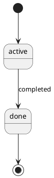

# Project Starter

> **Repo structure note:** This repo should be cloned so that `AGENTS.md` sits at the
> root — i.e. `project_starter/AGENTS.md`, not `project_starter/project_starter/AGENTS.md`.
> If you see a doubled folder after cloning, move the contents up one level.

A documentation-first template for AI-assisted development. Define what you're building before
an AI agent (Claude Code, etc.) starts writing code — then keep every doc in sync automatically
as work progresses.

This repo is a **pure template repository**. It contains no real project content — only blank
scaffolding under `templates/`. Copy `templates/` into a new project's `docs/` folder to start.

---

## How it works

1. **`AGENTS.md`** defines the rules an AI agent follows: which docs to create, when to update
   them, and what to do when a task or module completes.
2. **`templates/`** holds the blank scaffolding — every document the agent will fill in.
3. As work happens, the agent keeps `docs/` (in your actual project) in sync with what was built,
   following the checklist in `AGENTS.md`.

```
project_starter/                     ← this repo (template only)
├── AGENTS.md
├── debug-instrumentation-rules.md
├── code-quality-check.md            ← code review checklist for retrofitting existing projects
├── document-purposes.md             ← index: type → per-type file lookup
├── document-purposes-common.md      ← document purposes for entries that apply to all types
├── document-purposes-web-app.md     ← document purposes for Web App projects
├── document-purposes-cli-tool.md    ← document purposes for CLI Tool projects
├── document-purposes-library.md     ← document purposes for Library / SDK projects
├── document-purposes-data-pipeline.md ← document purposes for Data Pipeline projects
├── document-purposes-ml-pipeline.md ← document purposes for ML Pipeline projects
├── document-purposes-microservices.md ← document purposes for Microservices projects
├── document-purposes-llm-app.md     ← document purposes for AI / LLM App projects
└── templates/
    ├── project-requirements.md      ← project scope, goals, edge cases, acceptance criteria
    ├── project-plan.md              ← sprint/task breakdown per feature
    ├── current-state.md             ← the active task
    ├── sprint-sync.md               ← sprint-end Document Update Checklist (load only at sprint end)
    ├── changelog.md                 ← completed task history
    ├── task-log.md                  ← task verification log (AI writes one row per completed task)
    ├── sprint-change-log.md         ← implementation changes this sprint (doc sync deferred to sprint end)
    ├── codebase-map.md              ← package vs. custom code, by layer; includes project tree
    │
    ├── init/                        ← per-type project initialization sequences (load only the one that matches)
    │   ├── web-app.md
    │   ├── cli-tool.md
    │   ├── library.md
    │   ├── data-pipeline.md
    │   ├── ml-pipeline.md
    │   ├── microservices.md
    │   ├── llm-app.md
    │   ├── document-matrix.md       ← Required/Optional/N/A table per project type (load only when initializing)
    │   └── retrofit.md              ← Step-by-step retrofit procedure for existing codebases
    │
    ├── specs/
    │   │                              ── Universal (all project types) ──
    │   ├── quickstart.md            ← setup steps, prerequisites, local startup, verification
    │   ├── research.md              ← technology decisions + alternatives considered (excluded from PDF until filled)
    │   ├── glossary.md              ← business terms, technical terms, abbreviations
    │   ├── dependencies.md          ← runtime packages, dev packages, external services, infrastructure
    │   ├── test-plan.md             ← testing strategy, scope, environment, CI integration
    │   └── test-report.md           ← test results, pass/fail summary, coverage, known issues
    │   │                              ── Web App / Microservices ──
    │   ├── data-model.md            ← schema, indexes, state machines, migrations
    │   ├── api-contract.md          ← endpoints, events, validation rules, error codes (REST + WebSocket + GraphQL + gRPC)
    │   ├── permissions.md           ← roles, permission matrix, endpoint access control
    │   ├── logging-spec.md          ← logging rules, logger instantiation, module naming
    │   │                              ── CLI Tool ──
    │   ├── cli-contract.md          ← subcommands, flags, exit codes, stdin/stdout contract
    │   ├── release-guide.md         ← versioning policy, publish checklist, deprecation policy
    │   ├── compatibility-matrix.md  ← supported runtime versions, peer deps, known incompatibilities
    │   │                              ── Library / SDK ──
    │   ├── public-api.md            ← public functions/classes/types, stability tiers, deprecation log
    │   ├── release-guide.md         ← (same template as CLI Tool)
    │   ├── compatibility-matrix.md  ← (same template as CLI Tool)
    │   │                              ── Data Pipeline / ML Pipeline ──
    │   ├── pipeline-contract.md     ← inter-stage input/output contracts, cross-stage consistency check
    │   ├── data-model.md            ← schema, indexes (shared with Web App template)
    │   ├── logging-spec.md          ← (shared with Web App template)
    │   │                              ── ML Pipeline (additional) ──
    │   ├── model-contract.md        ← model input/output schema, production thresholds, retraining policy
    │   └── experiment-log.md        ← per-run experiment record (hypothesis → config → results → decision)
    │   │                              ── Microservices (additional) ──
    │   ├── service-catalog.md       ← all services: owner, port, URL, dependencies, events
    │   └── service-contract.md      ← inter-service REST contracts and event schemas
    │   │                              ── AI / LLM Application ──
    │   ├── llm-contract.md          ← model, system prompt, parameters, tool schemas, retry strategy
    │   ├── prompt-library.md        ← index only: prompt list + naming rules (no prompt content here)
    │   ├── prompts/
    │   │   └── [prompt-id]-prompt.md ← one file per prompt: template, variables, examples, version history
    │   ├── eval-spec.md             ← LLM-as-a-judge criteria, rubric, fixed test case set (stable config)
    │   ├── eval-log.md              ← append-only eval run results (load only when comparing versions)
    │   ├── rag-contract.md          ← retrieval sources, chunking, embedding model, vector store (optional)
    │   └── mcp-contract.md          ← MCP server connections, tool schemas, tool-use policy (optional)
    │
    ├── architecture/
    │   ├── architecture.md          ← components, data flow, structured YAML for diagram (all types)
    │   ├── backend.md               ← backend stack, layering, module pattern (not for Library / SDK)
    │   ├── frontend.md              ← frontend stack, page structure, component strategy (Web App / Microservices only)
    │   ├── database.md              ← entities/relationships (conceptual level; not for CLI / Library)
    │   ├── deployment.md            ← services, env vars, startup flow (Web App / Pipeline / Microservices)
    │   └── distribution.md          ← build, publish, install instructions (CLI Tool / Library / SDK)
    │
    ├── business/
    │   ├── business-process.md      ← index + rules for business process files (per process)
    │   ├── business-objects.md      ← index + rules for business object files (per object)
    │   └── business-rules.md        ← approval/validation/notification/audit rules
    │
    ├── modules/
    │   ├── module-data-flow.md      ← index + rules for module flow files (Feature / Background Job / Shared Utility)
    │   └── module-flow.md           ← index + rules for cross-module sequence files (per module)
    │
    └── script/
        ├── plantuml.jar             ← PlantUML renderer (download separately, see below)
        ├── schema_to_html.py        ← Prisma/SQL schema → ERD (interactive HTML + static SVG)
        ├── build_pdf.py             ← renders all ```plantuml blocks via PlantUML + merges docs/ into PDF
        ├── scan_codebase.py         ← scans src/ and reports which modules are undocumented; use --project-type to classify by type
        └── pdf_allowlist.py         ← single source of truth for which files appear in the PDF
```

When a new project starts, `templates/` is copied in and becomes `docs/` — see
[Project Initialization](#project-initialization) below.

> **Note on file naming:** template files in this repo do not carry version suffixes
> (e.g. `module-data-flow.md`, not `module-data-flow-v2.md`). Version history is tracked
> in `CHANGELOG.md` at the repo root. When copying templates into a new project's `docs/`,
> use the base filename without any suffix.

---

## Project Initialization

A new project does **not** keep `templates/` — it copies only the files its project type needs
into `docs/`, filling in the placeholders as it goes. The document matrix in `templates/init/document-matrix.md` defines
which files are required, optional, or N/A for each type.

The root files are the same for every type:

```
new_project/
├── AGENTS.md                        ← declare Project Type at the top
├── debug-instrumentation-rules.md
├── code-quality-check.md
├── document-purposes.md             ← index: maps project type → per-type file
├── document-purposes-common.md      ← loaded by all types
├── document-purposes-<type>.md      ← loaded for your declared type (e.g. document-purposes-web-app.md)
└── docs/
    ├── project-requirements.md
    ├── project-plan.md
    ├── current-state.md
    ├── changelog.md
    ├── task-log.md
    ├── sprint-change-log.md
    ├── codebase-map.md
    ├── specs/ architecture/ modules/ script/    ← vary by type (see below)
```

The `docs/specs/`, `docs/architecture/`, and `docs/modules/` contents differ per project type:

### Web App

```
docs/specs/
├── research.md  quickstart.md  data-model.md  api-contract.md
├── permissions.md  logging-spec.md
docs/architecture/
├── architecture.md  backend.md  database.md  deployment.md
└── frontend.md                                              ← optional
docs/business/
├── business-process.md  ← index
├── [process-name]-process.md                               ← one per process
├── business-objects.md  ← index
├── [object-name]-object.md                                 ← one per object
└── business-rules.md
docs/modules/
├── module-data-flow.md  module-flow.md                     ← index files
└── [module-name]/
    ├── [module]-module-data-flow.md
    └── log-[module].md
```

### CLI Tool

```
docs/specs/
├── research.md  quickstart.md  cli-contract.md
├── release-guide.md  logging-spec.md
└── compatibility-matrix.md                                 ← optional
docs/architecture/
└── architecture.md  backend.md  distribution.md
docs/modules/
├── module-data-flow.md  module-flow.md                     ← index files
└── [module-name]/
    └── [module]-module-data-flow.md
```

### Library / SDK

```
docs/specs/
├── research.md  quickstart.md  public-api.md
└── release-guide.md  compatibility-matrix.md
docs/architecture/
└── architecture.md  distribution.md                        ← architecture.md optional
docs/modules/
├── module-data-flow.md  module-flow.md
└── [module-name]/
    └── [module]-module-data-flow.md
```

### Data Pipeline

```
docs/specs/
├── research.md  quickstart.md  pipeline-contract.md
├── data-model.md  logging-spec.md  pipeline-debug.md
docs/architecture/
└── architecture.md  backend.md  database.md  deployment.md
docs/modules/
├── module-data-flow.md  module-flow.md                     ← index files
└── [stage-name]/                                           ← one per Pipeline Stage
    └── [stage]-module-data-flow.md
```

### ML Pipeline

```
docs/specs/
├── research.md  quickstart.md  pipeline-contract.md
├── data-model.md  model-contract.md  experiment-log.md  logging-spec.md  pipeline-debug.md
docs/architecture/
└── architecture.md  backend.md  database.md  deployment.md
docs/modules/
├── module-data-flow.md  module-flow.md
└── [stage-name]/
    └── [stage]-module-data-flow.md
```

### Microservices

Each service has its own `docs/` following the Web App structure above.
At the system level, add:

```
docs/specs/
├── service-catalog.md                                      ← all services: owner, port, deps
└── service-contract.md                                     ← inter-service REST + event schemas
docs/architecture/
├── architecture.md                                         ← system-level component diagram
└── deployment.md                                           ← cross-service deployment topology
```

### AI / LLM Application

```
docs/specs/
├── research.md  quickstart.md  llm-contract.md  logging-spec.md
├── llm-debug.md
├── prompt-library.md                                       ← index only
├── prompts/
│   └── [prompt-id]-prompt.md                              ← one per prompt
├── eval-spec.md                                            ← judge config + criteria + test cases
├── eval-log.md                                             ← append-only run results
├── rag-contract.md                                         ← optional, if using RAG
└── mcp-contract.md                                         ← optional, if connecting MCP servers
docs/architecture/
└── architecture.md
docs/modules/
├── module-data-flow.md  module-flow.md
└── [module-name]/
    └── [module]-module-data-flow.md
```

### Mixed / Hybrid Project Types

Some projects span more than one type. Declare both using `+` in `AGENTS.md` and take the union
of their required documents — everything goes in the same `docs/` folder.

```
Project Type: Data Pipeline + Web App
```

Common combinations and what the second type adds:

| Combination | Extra docs from second type |
|---|---|
| Data Pipeline + Web App | `api-contract.md`, `permissions.md`, `frontend.md` (dashboard) |
| CLI Tool + Library | `public-api.md`, `compatibility-matrix.md` |
| ML Pipeline + Web App | `api-contract.md`, `permissions.md` (serving endpoint) |
| AI / LLM App + Web App | `api-contract.md`, `frontend.md`, `deployment.md` |

`AGENTS.md` drives initialization — declare the project type at the top, then load only the matching
`templates/init/[type].md` file. Each init file contains the full step-by-step sequence for that type.
For hybrid types, load each relevant init file and union the step lists (skip duplicates).

---

## Working on an existing project

The agent reads, in order:

1. `AGENTS.md`
2. `docs/current-state.md` — the active task
3. Only the docs the current task actually needs (it does **not** scan the whole repo)

After finishing a task, it applies the filtered `Doc Checklist` in `docs/current-state.md`
(pre-filled at task setup using the quick-filter guide). At sprint end, it loads `sprint-sync.md`
and runs the full Document Update Checklist across all docs.

When a task finishes **all** work for a module, three more things happen automatically:

- Logger calls are inserted into the module's code (per `logging-spec.md`), and
  `docs/modules/[module]/log-[module].md` is created/updated
- You're asked whether to add temporary debug instrumentation (per `debug-instrumentation-rules.md`)
- The English PDF is regenerated (`docs/project-documentation-en.pdf`)

---

## Retrofitting an existing project

If a project already has code but no documentation, use the retrofit flow in `templates/init/retrofit.md`.
The flow has five steps:

1. **Read the codebase** — entry point, schema, one complete module
2. **Run the module inventory scan** — `scan_codebase.py` lists every source folder and flags which
   are undocumented. You confirm the list before any documentation is written, so nothing gets missed
3. **Code Quality Check** — the agent runs `code-quality-check.md` and produces a report
   covering layering, Package First violations, naming, schema design, security, and error
   handling. You decide whether to fix issues first or document the codebase as-is
4. **Fill in architecture and spec documents** — describe what actually exists, not what should exist.
   Templates are architecture-agnostic — use your actual layer names, not assumed patterns
5. **Fill in module flow files** — one module at a time. Each module is classified as
   Feature, Background Job, Pipeline Stage, Command, Namespace, Service, or Shared Utility —
   each type has its own flow format
6. **Fill in project status** — reconstruct requirements, mark existing modules as completed in
   project-plan.md, generate the PDF

`code-quality-check.md` can also be used independently at any time as a standalone code review checklist.

---

## Module types

`module-data-flow.md` supports four module types, each with its own flow format:

| Type | Description | Entry point |
|---|---|---|
| **Feature** | Handles requests or commands — HTTP, GraphQL, CLI, RPC, WebSocket, etc. | Request / command |
| **Background Job** | Runs outside the request cycle — queue consumer, cron, event handler, worker | Queue message / schedule / event |
| **Pipeline Stage** | Consumes an upstream dataset or artifact, transforms or validates it, and produces a downstream dataset or artifact. Used in Data Pipeline and ML Pipeline projects. | Upstream data contract |
| **Shared Utility** | No entry point — called by other modules | None (class block only) |

**Background Job vs Pipeline Stage:** use Background Job when the module's primary concern is responding to an event or message. Use Pipeline Stage when the module's primary concern is transforming or validating data as part of a larger data flow — the distinguishing question is "does this module have an upstream data contract and a downstream data contract?"

The flow format does not prescribe layer names. Use whatever names your architecture actually has
(Controller, Handler, UseCase, Resolver, Model, etc.).

---

## Diagrams

Eight scripts turn structured Markdown blocks into diagrams — each outputs both an **interactive HTML**
(drag, zoom, click) and a **static SVG** (for PDF embedding). All UML scripts automatically
append a type suffix to the output filename to avoid collisions (e.g. `data-model-state.html`).

| Script | Input | Diagram type | Where it's embedded |
|---|---|---|---|
| Tool | Input | Diagram type | Where it appears |
|---|---|---|---|
| PlantUML (via `build_pdf.py`) | Any ` ```plantuml ` block in any `.md` | All UML types | Wherever the block appears in the PDF |
| `schema_to_html.py` | Prisma / SQL file | ERD | `specs/data-model.md` |

> **Multiple blocks per file:** all six UML scripts support multiple diagram blocks in a
> single `.md` file. Each block generates its own HTML + SVG pair, named by its `title:`
> slug (e.g. `data-model-workorder-status-state.html`). A file with a single block keeps
> the original naming behaviour.

> **Diagram placement markers:** to control where a diagram appears in the PDF, add
> `<!-- diagram: KEY -->` at the desired location in the target document (where `KEY` is
> the HTML filename without extension and suffix, e.g. `<!-- diagram: architecture -->`).
> Without a marker, diagrams are appended to the end of their target section.

```bash
# All PlantUML diagrams are rendered automatically when you run:
python3 docs/script/build_pdf.py docs --lang en -o docs/project-documentation-en.pdf

# ERD only (schema_to_html.py is still used for the database diagram):
python3 docs/script/schema_to_html.py path/to/schema.prisma -o docs/specs/schema.html
```

---

## Module inventory scan

Before documenting an existing codebase, run the inventory scan to get an objective view of
what exists and what is already documented:

```bash
# Show tree view + coverage report (auto-detects module type from folder names)
python3 docs/script/scan_codebase.py src

# Explicit project type — uses correct vocabulary (Feature / Pipeline Stage / Command / Namespace / Service)
python3 docs/script/scan_codebase.py src --project-type data-pipeline
python3 docs/script/scan_codebase.py src --project-type web-app
python3 docs/script/scan_codebase.py src --project-type cli-tool
# Valid values: web-app | cli-tool | library | data-pipeline | ml-pipeline | microservices | llm-app

# Update the Project Structure and Coverage Summary sections in codebase-map.md automatically
python3 docs/script/scan_codebase.py src --project-type web-app --update docs/codebase-map.md
```

The scan detects folder names to classify folders by module type. Pass `--project-type` to
use the correct vocabulary for your project (e.g. Pipeline Stage for data pipelines,
Command for CLI tools, Namespace for libraries, Service for microservices).
Re-run at the end of Step 3 (retrofit) to confirm full coverage.

---

## Setting up PlantUML

All UML diagrams use [PlantUML](https://plantuml.com) syntax (` ```plantuml ` blocks).
`build_pdf.py` renders them automatically — no separate steps needed.

**Requirements:**
1. Java (JDK 11+): `java -version`
2. PlantUML jar: download from https://plantuml.com/download and place at `docs/script/plantuml.jar`
   Or set the environment variable: `export PLANTUML_JAR=/path/to/plantuml.jar`

**Diagram syntax:** write your diagram inside a ` ```plantuml ` block in any `.md` file:
```


## Generating the merged PDF

Combines every real document under `docs/` (per the allowlist in `pdf_allowlist.py`) into a
single PDF — table of contents, page numbers, and diagrams embedded as images
with a clickable link to the original interactive HTML.

```bash
pip install markdown weasyprint cairosvg --break-system-packages

# English PDF — filter to project type (recommended)
python3 docs/script/build_pdf.py docs --lang en --project-type data-pipeline -o docs/project-documentation-en.pdf

# Hybrid project — comma-separate types
python3 docs/script/build_pdf.py docs --lang en --project-type data-pipeline,web-app -o docs/project-documentation-en.pdf

# No type filter — include all files that exist (backward-compatible)
python3 docs/script/build_pdf.py docs --lang en -o docs/project-documentation-en.pdf

# Chinese PDF (manual, only when needed)
python3 docs/script/build_pdf.py docs-zh --lang zh --project-type data-pipeline -o docs/project-documentation-zh.pdf
```

Valid `--project-type` values: `web-app`, `cli-tool`, `library`, `data-pipeline`, `ml-pipeline`, `microservices`, `llm-app`

Google Translate (free, no API key needed), preserving code blocks, inline code, HTML comments,
and table structure. It mirrors the translated files into `docs-zh/`, which `build_pdf.py` then
reads exactly like `docs/`.

> Translation quality is good for headings and short sentences. Technical jargon and proper nouns
> may need manual review after translation.

To add a new document to the PDF, add it to **`docs/script/pdf_allowlist.py`** only —
`build_pdf.py` imports from it automatically. Note that
`business/*-process.md`, `business/*-object.md`, `modules/*/*-module-data-flow.md`,
and `specs/prompts/*-prompt.md` are auto-scanned and do not need to be added manually.

---

## Key design decisions

- **Templates vs. docs**: `templates/` is always blank scaffolding. Real content only ever lives
  in a project's `docs/` folder, never in this repo.
- **Architecture-agnostic templates**: `backend.md`, `module-data-flow.md`, and `logging-spec.md`
  do not assume any specific layering pattern or language. Use your actual layer names and
  logger API — the templates provide structure, not prescription.
- **Module inventory before documentation**: the retrofit flow requires running `scan_codebase.py`
  (with `--project-type` for correct vocabulary) and getting user confirmation before any
  documentation is written — so undocumented modules are caught at the start, not discovered at the end.
- **Six module types**: Feature (request-driven), Background Job (event/schedule-driven),
  Pipeline Stage (data-contract-driven, Data Pipeline / ML Pipeline), Command (CLI Tool),
  Namespace (Library / SDK), Service (Microservices), and Shared Utility (no entry point).
  Each has its own flow format in `module-data-flow.md`. `scan_codebase.py --project-type`
  selects the correct label automatically.
- **Six-chapter PDF structure**: the generated PDF is organized into Introduction / Plan /
  Design / Build / Test / Deployment — matching standard system analysis document conventions.
  The chapter each file belongs to is configured in `pdf_allowlist.py`.
- **Single PDF allowlist**: `pdf_allowlist.py` is the only file to edit when adding documents
  to the PDF. `build_pdf.py` imports from it.
- **Task granularity**: each task should be roughly half a day to one day of work, and
  independently completable as a single Current Task — planning rules are defined directly in `AGENTS.md`.
- **Package First**: prefer an existing package, then an existing utility, then framework
  convention, and only write custom code for business logic, domain rules, data mapping, or
  system integration.
- **Incremental updates only**: `codebase-map.md` and `modules/module-data-flow.md` are updated one task
  at a time — the agent never re-scans the whole repository to regenerate them.
