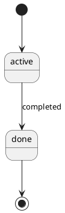

# Project Starter

> **Repo structure note:** This repo should be cloned so that `AGENTS.md` sits at the
> root — i.e. `project_starter/AGENTS.md`, not `project_starter/project_starter/AGENTS.md`.
> If you see a doubled folder after cloning, move the contents up one level.

A documentation-first template for AI-assisted development. Define what you're building before
an AI agent (Claude Code, etc.) starts writing code — then keep every doc in sync automatically
as work progresses.

This repo is a **pure template repository**. It contains no real project content — only blank
scaffolding under `templates/`. Copy `templates/` into a new project's `docs/` folder to start.

---

## How it works

1. **`AGENTS.md`** defines the rules an AI agent follows: which docs to create, when to update
   them, and what to do when a task or module completes.
2. **`templates/`** holds the blank scaffolding — every document the agent will fill in.
3. As work happens, the agent keeps `docs/` (in your actual project) in sync with what was built,
   following the checklist in `AGENTS.md`.

```
project_starter/                     ← this repo (template only)
├── AGENTS.md
├── debug-instrumentation-rules.md
├── code-quality-check.md            ← code review checklist for retrofitting existing projects
├── document-purposes.md             ← reference for what each document is for and when it changes
└── templates/
    ├── project-requirements.md      ← project scope, goals, edge cases, acceptance criteria
    ├── project-plan.md              ← sprint/task breakdown per feature
    ├── current-state.md             ← the active task
    ├── changelog.md                 ← completed task history
    ├── task-log.md                  ← task verification log (AI writes one row per completed task)
    ├── codebase-map.md              ← package vs. custom code, by layer; includes project tree
    │
    ├── specs/                        ← quickstart.md, research.md, data-model.md, api-contract.md,
    │                                     permissions.md, logging-spec.md, glossary.md,
    │                                     dependencies.md, test-plan.md, test-report.md
    │   ├── quickstart.md            ← setup steps, prerequisites, local startup, verification
    │   ├── research.md              ← technology decisions + alternatives considered (excluded from PDF until filled)
    │   ├── data-model.md            ← schema, indexes, state machines, migrations
    │   ├── api-contract.md          ← endpoints, events, validation rules, error codes (REST + WebSocket + GraphQL + gRPC + CLI)
    │   ├── permissions.md           ← roles, permission matrix, endpoint access control
    │   ├── logging-spec.md          ← logging rules, logger instantiation, module naming
    │   ├── glossary.md              ← business terms, technical terms, abbreviations
    │   ├── dependencies.md          ← runtime packages, dev packages, external services, infrastructure
    │   ├── test-plan.md             ← testing strategy, scope, environment, CI integration
    │   └── test-report.md           ← test results, pass/fail summary, coverage, known issues
    │
    ├── architecture/
    │   ├── architecture.md          ← components, data flow, structured YAML for diagram
    │   ├── backend.md               ← backend stack, layering, module pattern (architecture-agnostic)
    │   ├── frontend.md              ← frontend stack, page structure, component strategy
    │   ├── database.md              ← entities/relationships (conceptual level)
    │   └── deployment.md            ← services, env vars, startup flow, verification steps
    │
    ├── business/
    │   ├── business-process.md      ← index + rules for business process files (per process)
    │   ├── business-objects.md      ← index + rules for business object files (per object)
    │   └── business-rules.md        ← approval/validation/notification/audit rules
    │
    ├── modules/
    │   ├── module-data-flow.md      ← index + rules for module flow files (Feature / Background Job / Shared Utility)
    │   └── module-flow.md           ← index + rules for cross-module sequence files (per module)
    │
    └── script/
        ├── plantuml.jar             ← PlantUML renderer (download separately, see below)
        ├── schema_to_html.py        ← Prisma/SQL schema → ERD (interactive HTML + static SVG)
        ├── build_pdf.py             ← auto-renders all ```plantuml blocks via PlantUML + generates PDF
        ├── scan_codebase.py         ← scans src/ and reports which modules are undocumented
        ├── build_pdf.py             ← merges all of docs/ into one PDF, with diagrams embedded
        └── pdf_allowlist.py         ← single source of truth for which files appear in the PDF
```

When a new project starts, `templates/` is copied in and becomes `docs/` — see
[Project Initialization](#project-initialization) below.

> **Note on file naming:** template files in this repo do not carry version suffixes
> (e.g. `module-data-flow.md`, not `module-data-flow-v2.md`). Version history is tracked
> in `CHANGELOG.md` at the repo root. When copying templates into a new project's `docs/`,
> use the base filename without any suffix.

---

## Project Initialization

A new project does **not** keep `templates/` — it copies each file into `docs/`, filling in the
placeholders as it goes:

```
new_project/
├── AGENTS.md
├── debug-instrumentation-rules.md
├── code-quality-check.md
├── document-purposes.md
└── docs/
    ├── project-requirements.md
    ├── project-plan.md
    ├── current-state.md
    ├── changelog.md
    ├── codebase-map.md
    ├── specs/
    ├── architecture/
    ├── business/
    │   ├── business-process.md            ← index
    │   ├── [process-name]-process.md      ← one per business process, auto-included in PDF
    │   ├── business-objects.md            ← index
    │   ├── [object-name]-object.md        ← one per business object, auto-included in PDF
    │   └── business-rules.md
    ├── modules/
    │   ├── module-data-flow.md            ← index file
    │   ├── module-flow.md                 ← index file
    │   └── [module-name]/                 ← one subfolder per module (Feature or Background Job)
    │       ├── [module]-module-data-flow.md  ← auto-included in PDF
    │       └── log-[module].md               ← not in PDF, dev reference only
    └── script/
```

`AGENTS.md` drives this automatically — an AI agent starting a new project will create each file
from its matching template in order (requirements → research → architecture → data model →
API contract → permissions → plan → current state).

---

## Working on an existing project

The agent reads, in order:

1. `AGENTS.md`
2. `docs/current-state.md` — the active task
3. Only the docs the current task actually needs (it does **not** scan the whole repo)

After finishing a task, it works through a mandatory checklist (see `AGENTS.md` →
`Document Update Checklist`) — checking whether each spec/architecture/business doc needs
updating based on what just changed.

When a task finishes **all** work for a module, three more things happen automatically:

- Logger calls are inserted into the module's code (per `logging-spec.md`), and
  `docs/modules/[module]/log-[module].md` is created/updated
- You're asked whether to add temporary debug instrumentation (per `debug-instrumentation-rules.md`)
- The English PDF is regenerated (`docs/project-documentation-en.pdf`)

---

## Retrofitting an existing project

If a project already has code but no documentation, use the retrofit flow in `AGENTS.md`
(`If retrofitting an existing project`). The flow has five steps:

1. **Read the codebase** — entry point, schema, one complete module
2. **Run the module inventory scan** — `scan_codebase.py` lists every source folder and flags which
   are undocumented. You confirm the list before any documentation is written, so nothing gets missed
3. **Code Quality Check** — the agent runs `code-quality-check.md` and produces a report
   covering layering, Package First violations, naming, schema design, security, and error
   handling. You decide whether to fix issues first or document the codebase as-is
4. **Fill in architecture and spec documents** — describe what actually exists, not what should exist.
   Templates are architecture-agnostic — use your actual layer names, not assumed patterns
5. **Fill in module flow files** — one module at a time. Each module is classified as
   Feature, Background Job, or Shared Utility — each type has its own flow format
6. **Fill in project status** — reconstruct requirements, mark existing modules as completed in
   project-plan.md, generate the PDF

`code-quality-check.md` can also be used independently at any time as a standalone code review checklist.

---

## Module types

`module-data-flow.md` supports three module types, each with its own flow format:

| Type | Description | Entry point |
|---|---|---|
| **Feature** | Handles requests or commands — HTTP, GraphQL, CLI, RPC, WebSocket, etc. | Request / command |
| **Background Job** | Runs outside the request cycle — queue consumer, cron, event handler, worker | Queue message / schedule / event |
| **Shared Utility** | No entry point — called by other modules | None (class block only) |

The flow format does not prescribe layer names. Use whatever names your architecture actually has
(Controller, Handler, UseCase, Resolver, Model, etc.).

---

## Diagrams

Eight scripts turn structured Markdown blocks into diagrams — each outputs both an **interactive HTML**
(drag, zoom, click) and a **static SVG** (for PDF embedding). All UML scripts automatically
append a type suffix to the output filename to avoid collisions (e.g. `data-model-state.html`).

| Script | Input | Diagram type | Where it's embedded |
|---|---|---|---|
| Tool | Input | Diagram type | Where it appears |
|---|---|---|---|
| PlantUML (via `build_pdf.py`) | Any ` ```plantuml ` block in any `.md` | All UML types | Wherever the block appears in the PDF |
| `schema_to_html.py` | Prisma / SQL file | ERD | `specs/data-model.md` |

> **Multiple blocks per file:** all six UML scripts support multiple diagram blocks in a
> single `.md` file. Each block generates its own HTML + SVG pair, named by its `title:`
> slug (e.g. `data-model-workorder-status-state.html`). A file with a single block keeps
> the original naming behaviour.

> **Diagram placement markers:** to control where a diagram appears in the PDF, add
> `<!-- diagram: KEY -->` at the desired location in the target document (where `KEY` is
> the HTML filename without extension and suffix, e.g. `<!-- diagram: architecture -->`).
> Without a marker, diagrams are appended to the end of their target section.

```bash
# All PlantUML diagrams are rendered automatically when you run:
python3 docs/script/build_pdf.py docs --lang en -o docs/project-documentation-en.pdf

# ERD only (schema_to_html.py is still used for the database diagram):
python3 docs/script/schema_to_html.py path/to/schema.prisma -o docs/specs/schema.html
```

---

## Module inventory scan

Before documenting an existing codebase, run the inventory scan to get an objective view of
what exists and what is already documented:

```bash
# Show tree view + coverage report
python3 docs/script/scan_codebase.py src

# Update the Project Structure and Coverage Summary sections in codebase-map.md automatically
python3 docs/script/scan_codebase.py src --update docs/codebase-map.md
```

The scan detects folder names to classify folders as Feature, Background Job, or
Shared/Infrastructure. Re-run at the end of Step 3 (retrofit) to confirm full coverage.

---

## Setting up PlantUML

All UML diagrams use [PlantUML](https://plantuml.com) syntax (` ```plantuml ` blocks).
`build_pdf.py` renders them automatically — no separate steps needed.

**Requirements:**
1. Java (JDK 11+): `java -version`
2. PlantUML jar: download from https://plantuml.com/download and place at `docs/script/plantuml.jar`
   Or set the environment variable: `export PLANTUML_JAR=/path/to/plantuml.jar`

**Diagram syntax:** write your diagram inside a ` ```plantuml ` block in any `.md` file:
```


## Generating the merged PDF

Combines every real document under `docs/` (per the allowlist in `pdf_allowlist.py`) into a
single PDF — table of contents, page numbers, and diagrams embedded as images
with a clickable link to the original interactive HTML.

```bash
pip install markdown weasyprint cairosvg --break-system-packages

# English PDF (runs automatically when a module completes)
python3 docs/script/build_pdf.py docs --lang en -o docs/project-documentation-en.pdf

# Chinese PDF (manual, only when needed)
python3 docs/script/build_pdf.py docs-zh --lang zh -o docs/project-documentation-zh.pdf
```

Google Translate (free, no API key needed), preserving code blocks, inline code, HTML comments,
and table structure. It mirrors the translated files into `docs-zh/`, which `build_pdf.py` then
reads exactly like `docs/`.

> Translation quality is good for headings and short sentences. Technical jargon and proper nouns
> may need manual review after translation.

To add a new document to the PDF, add it to **`docs/script/pdf_allowlist.py`** only —
`build_pdf.py` imports from it automatically. Note that
`business/*-process.md`, `business/*-object.md`, and `modules/*/*-module-data-flow.md`
are auto-scanned and do not need to be added manually.

---

## Key design decisions

- **Templates vs. docs**: `templates/` is always blank scaffolding. Real content only ever lives
  in a project's `docs/` folder, never in this repo.
- **Architecture-agnostic templates**: `backend.md`, `module-data-flow.md`, and `logging-spec.md`
  do not assume any specific layering pattern or language. Use your actual layer names and
  logger API — the templates provide structure, not prescription.
- **Module inventory before documentation**: the retrofit flow requires running `scan_codebase.py`
  and getting user confirmation before any documentation is written — so undocumented modules
  are caught at the start, not discovered at the end.
- **Three module types**: Feature (request-driven), Background Job (event/schedule-driven), and
  Shared Utility (no entry point). Each has its own flow format in `module-data-flow.md`.
- **Six-chapter PDF structure**: the generated PDF is organized into Introduction / Plan /
  Design / Build / Test / Deployment — matching standard system analysis document conventions.
  The chapter each file belongs to is configured in `pdf_allowlist.py`.
- **Single PDF allowlist**: `pdf_allowlist.py` is the only file to edit when adding documents
  to the PDF. `build_pdf.py` imports from it.
- **Task granularity**: each task should be roughly half a day to one day of work, and
  independently completable as a single Current Task — planning rules are defined directly in `AGENTS.md`.
- **Package First**: prefer an existing package, then an existing utility, then framework
  convention, and only write custom code for business logic, domain rules, data mapping, or
  system integration.
- **Incremental updates only**: `codebase-map.md` and `modules/module-data-flow.md` are updated one task
  at a time — the agent never re-scans the whole repository to regenerate them.
