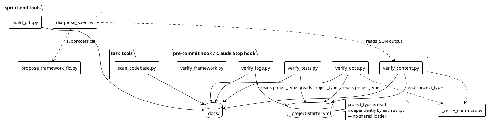
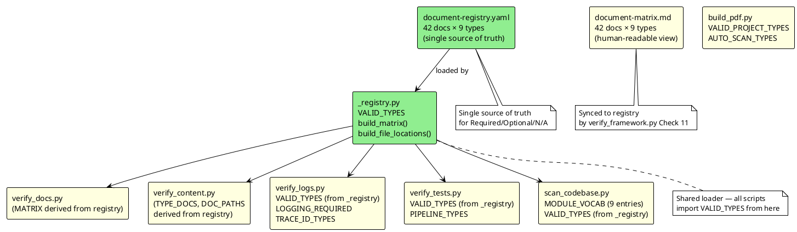

# Architecture Analysis — project_starter_v4

## Current Architecture

The framework consists of 12 Python scripts, one shared utility module, and 9 AI-facing guidance files. Scripts split into three functional groups:

**Verification layer** — run at every `git commit` (pre-commit hook) or sprint end:
- `verify_docs.py` — document presence and fill quality
- `verify_content.py` — spec content quality (per-doc checker functions)
- `verify_logs.py` — log documentation coverage
- `verify_tests.py` — test coverage and report currency
- `verify_framework.py` — internal consistency of the framework itself

**Support layer** — run at sprint end or on demand:
- `diagnose_spec.py` — classify verify output → project-level vs framework-level gaps
- `propose_framework_fix.py` — open PRs on project_starter_v4 for framework gaps
- `build_pdf.py` — render docs/ to PDF via PlantUML

**Task layer** — run during normal task work:
- `scan_codebase.py` — source tree → codebase-map.md

**Shared utility:**
- `_verify_common.py` — `_is_placeholder`, `_section_body` (53 lines; imported by verify_content.py, verify_docs.py)

---

## Dependency Graph — Hardcoded Project-Type Knowledge

Each node is a file. Red = encodes the primary document × type matrix. Yellow = encodes a subset of that knowledge independently.

---

## Coupling Problem Catalogue

### ✅ Problem 1 — VALID_TYPES declared in four separate scripts (resolved)

`_registry.py` is the single source. All scripts now import `VALID_TYPES` from it. Adding a new project type requires one edit to `_registry.py`.

### ✅ Problem 2 — Document × type matrix encoded in three places (resolved)

`document-registry.yaml` is the single source. `verify_docs.py` derives `MATRIX` from it via `build_matrix()`. `verify_content.py` derives `TYPE_DOCS` and `DOC_PATHS` from it. `document-matrix.md` is kept as a human-readable view; `verify_framework.py` Check 11 validates it stays in sync with the registry.

### ✅ Problem 3 — Document file paths encoded in two places (resolved)

`document-registry.yaml` `path` field is the single source. `verify_docs.py` derives `FILE_LOCATIONS` via `build_file_locations()`. `verify_content.py` derives `DOC_PATHS` via `build_doc_paths()`. Moving a document requires one edit to the registry.

### ⚠️ Problem 4 — Per-type behavioural flags scattered across scripts (open)

`VALID_TYPES` is now centralised, but the per-type behavioural sets remain in individual scripts:

| Script | Constant | Per-type rule |
|---|---|---|
| `verify_logs.py` | `LOGGING_REQUIRED`, `TRACE_ID_TYPES` | Which types require logging-spec.md / trace_id propagation |
| `verify_tests.py` | `PIPELINE_TYPES` | Which types use pipeline-specific test checks |
| `verify_content.py` | `UNIVERSAL_DOCS` | 4 docs that apply to all types regardless |
| `scan_codebase.py` | `guess_type()` | Per-type module naming heuristics |

These remain local to each script. No cross-script consistency check exists for them.

### ✅ Problem 5 — AI startup cost: project type resolved by inference (resolved)

`build-context.py` exists at the repo root. It reads `.project-starter.yml` + `document-registry.yaml` and writes `.ai/AI_CONTEXT.md` with a deterministic ordered read list. `orchestrator.py` provides the broader workflow plan. AI agents read `.ai/AI_CONTEXT.md` on startup rather than inferring from AGENTS.md prose.

---

## Responsibility Boundaries (current)

| Concern | Owner | Status |
|---|---|---|
| Valid type list | `_registry.py` → imported by all scripts | ✅ Centralised |
| Document → type mapping (R/O/N) | `document-registry.yaml` → `build_matrix()` | ✅ Centralised |
| Document → path mapping | `document-registry.yaml` → `build_file_locations()` / `build_doc_paths()` | ✅ Centralised |
| Human-readable matrix | `document-matrix.md` synced by Check 11 | ✅ Guarded |
| Per-type behavioural flags | Scattered sets in `verify_logs.py`, `verify_tests.py`, `verify_content.py` | ⚠️ Open (Problem 4) |
| Task startup context | `build-context.py` → `.ai/AI_CONTEXT.md` | ✅ Implemented |
