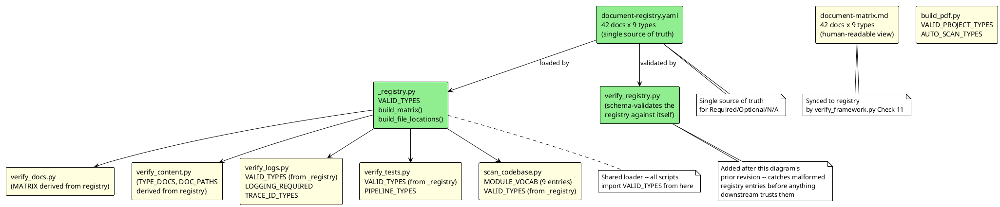

# Architecture Analysis — project_starter_v5

> Refreshed 2026-08-22. Previous revision described a 5-validator, pre-orchestrator snapshot of
> the framework and had drifted from the actual codebase — the orchestrator, adapter, skill, and
> telemetry layers below existed in code but not in this document. Rewritten from the current
> source tree, not from memory of the previous revision. Updated same day to add
> `llm_security_review.py` (`verify_security.py --llm-review`) and `verify_workflow_registry.py`,
> both added after the initial rewrite.

## Current Architecture

The framework is four layers: **entry points** (how a project starts using it), **orchestration**
(how a task's validator sequence is decided), **verification** (the gates that actually run), and
**agent adapters + telemetry** (how the plan and its results reach an AI coding tool and get
recorded). 13 `verify_*.py` gates (9 always-on, 3 opt-in, 1 framework self-check), 2 LLM-wrapper
scripts invoked from two of those opt-in gates (`semantic.py`, `llm_security_review.py`), 4
further framework support tools, 6 root-level orchestration/detection scripts, 6 Claude-facing
Skills, and 2 agent adapters (Claude, Codex) as of this revision.

**Entry points** — run once per project, or on demand to re-classify:
- `detect_type.py` — infers project type from file layout / dependency manifests / free-text
  requirements; `--apply` writes the result straight into `.project-starter.yml`
- `init.py` (and `setup.sh --init`, which delegates to it for the bash-only path) — copies
  `templates/script/` → `docs/script/`, the matching `templates/init/<type>.md`, and
  `adapters/claude/skills/` → `.claude/skills/` into a fresh project

**Orchestration layer** — run at the start of every task:
- `orchestrator.py` — reads `.project-starter.yml` + `docs/current-state.md`, resolves the
  current task type, looks up the matching validator sequence in `workflow-registry.yaml`,
  invokes `build-context.py` internally, and writes `.ai/WORKFLOW.md` (a deterministic plan) plus
  an adapter-specific file (`adapters/claude/start-task.md` output, or the Codex equivalent) via
  `--adapter`
- `build-context.py` — reads the same config, queries `document-registry.yaml`, and writes
  `.ai/AI_CONTEXT.md`: an ordered list of exactly which docs to read for this task, so the agent
  doesn't infer scope from `AGENTS.md` prose
- `workflow-registry.yaml` — the single source for task_type → validator sequence (`feature`,
  `pipeline-stage`, `bug-fix`, `sprint-end`, `eval-run`, `iac-change`, `default`); orchestrator.py
  injects `--project-type` automatically and conditionally adds `--semantic`-adjacent gates
  (spec↔code, security, prose) only when their config keys are set in `.project-starter.yml`

**Verification layer** — always-on gates run at every `git commit` via `.githooks/pre-commit`:
- `verify_docs.py` — document presence and fill quality
- `verify_content.py` — spec content quality (per-doc checker functions)
- `verify_logs.py` — log documentation coverage
- `verify_tests.py` — test coverage and report currency
- `verify_module_docs.py` — module flow file coverage & quality
- `verify_index_coverage.py` — index-table ↔ per-item-file coverage
- `verify_acceptance.py` — functional requirements ↔ test coverage
- `verify_registry.py` — schema-validates `document-registry.yaml` itself
- `verify_workflow_registry.py` — schema-validates `workflow-registry.yaml` itself (script paths
  resolve, no empty `validators` list, a `default` entry exists); runs first in every sequence,
  same placement as `verify_registry.py`

**Verification layer — opt-in gates**, enabled per-project via `.project-starter.yml` keys, added
to the sequence by `orchestrator.py` only when configured:
- `verify_spec_code.py` (+ `_spec_code_adapters/`) — spec ↔ code drift, 20 registered framework
  adapters (fastapi, flask, express, django, click, typer, airflow, dagster, prefect, luigi,
  python_library, typescript, tool_schema, langchain, terraform, pulumi, ansible, react_native,
  flutter, swiftui); `--semantic` wraps any of these with `semantic.py`, an LLM-assisted pass for
  ambiguous field renames — opt-in only, explicitly excluded from `workflow-registry.yaml`
  sequences (developer-invoked analysis, not a commit gate)
- `verify_security.py` — SAST wrapper (bandit / eslint-plugin-security / Semgrep); `--llm-review`
  wraps it with `llm_security_review.py`, headlessly invoking Claude Code's `/security-review`
  Skill for the class of issue a pattern-matcher can't see — opt-in only, same exclusion from
  `workflow-registry.yaml` as `--semantic`
- `verify_prose.py` — Vale wrapper for prose-quality (vague wording, prose-form placeholders)

**Framework self-check / support tools** — run at sprint end or on demand:
- `verify_framework.py` — internal consistency of the framework itself
- `diagnose_spec.py` — classifies verify output → project-level vs framework-level gaps
- `propose_framework_fix.py` — opens PRs on project_starter_v5 for framework-level gaps
- `build_pdf.py` — renders `docs/` to PDF via PlantUML
- `scan_codebase.py` — source tree → `codebase-map.md`

**Shared utilities:**
- `_verify_common.py` — `_is_placeholder`, `_section_body` (with `@overload` for the
  `str`/`list[str]` return split), `read_doc_profile()`
- `_workflow_utils.py` — task-type resolution, YAML loading, shared by `orchestrator.py` and
  `build-context.py`

```plantuml
@startuml current-architecture
!theme plain
skinparam componentStyle rectangle

package "entry points" {
  [detect_type.py]
  [init.py / setup.sh]
}

package "orchestration" {
  [orchestrator.py]
  [build-context.py]
}

package "always-on gates\n(.githooks/pre-commit)" {
  [verify_docs.py]
  [verify_content.py]
  [verify_logs.py]
  [verify_tests.py]
  [verify_module_docs.py]
  [verify_index_coverage.py]
  [verify_acceptance.py]
  [verify_registry.py]
  [verify_workflow_registry.py]
}

package "opt-in gates\n(config-gated)" {
  [verify_spec_code.py]
  [semantic.py] as semantic
  [verify_security.py]
  [llm_security_review.py] as llmreview
  [verify_prose.py]
}

package "agent adapters" {
  [adapters/claude/*]
  [adapters/codex/*]
  [.claude/skills/*]
}

package "telemetry" {
  [telemetry_writer.py]
  [_otel.py]
  database "logs/telemetry/*.json" as telemetry_files
}

database ".project-starter.yml" as config
database "workflow-registry.yaml" as wfreg
database "docs/" as docs

[detect_type.py] --> config : --apply writes project_type
[orchestrator.py] --> config
[orchestrator.py] --> wfreg : resolves validator sequence
[verify_workflow_registry.py] --> wfreg : schema-validates
[orchestrator.py] --> [build-context.py] : invokes internally
[orchestrator.py] --> [adapters/claude/*] : --adapter renders\nstart-task.md
[build-context.py] --> docs
[build-context.py] ..> ".ai/AI_CONTEXT.md"

[verify_docs.py] --> docs
[verify_content.py] --> docs
[verify_logs.py] --> docs
[verify_tests.py] --> docs
[verify_spec_code.py] --> semantic : --semantic wraps adapter
[verify_security.py] --> llmreview : --llm-review wraps it

[telemetry_writer.py] --> telemetry_files : task-run.json
[semantic] --> telemetry_files : token-usage.json\n(usage, cost, budget)
[llmreview] --> telemetry_files : security-review-usage.json\n(cost, duration, turns)
[_otel.py] ..> telemetry_files : dual-emit as OTel span\n(opt-in, OTEL_EXPORTER_OTLP_ENDPOINT)

note right of wfreg
  task_type -> validator list;
  opt-in gates added only when
  their .project-starter.yml
  key is set
end note

note right of semantic
  never appears in
  workflow-registry.yaml —
  developer-invoked, not a gate
end note

note right of llmreview
  same rule as semantic.py —
  developer-invoked, not a gate
end note
@enduml
```

---

## Dependency Graph — Hardcoded Project-Type Knowledge

Each node is a file. Red = encodes the primary document × type matrix. Yellow = encodes a subset
of that knowledge independently.

```plantuml
@startuml coupling-graph
!theme plain

rectangle "_registry.py\nVALID_TYPES\nbuild_matrix()\nbuild_file_locations()" as reg #LightGreen
rectangle "document-registry.yaml\n42 docs x 9 types\n(single source of truth)" as yaml #LightGreen
rectangle "verify_registry.py\n(schema-validates the\nregistry against itself)" as vreg #LightGreen

rectangle "verify_docs.py\n(MATRIX derived from registry)" as vd #LightYellow
rectangle "verify_content.py\n(TYPE_DOCS, DOC_PATHS\nderived from registry)" as vc #LightYellow
rectangle "document-matrix.md\n42 docs x 9 types\n(human-readable view)" as dm #LightYellow

rectangle "verify_logs.py\nVALID_TYPES (from _registry)\nLOGGING_REQUIRED\nTRACE_ID_TYPES" as vl #LightYellow
rectangle "verify_tests.py\nVALID_TYPES (from _registry)\nPIPELINE_TYPES" as vt #LightYellow
rectangle "build_pdf.py\nVALID_PROJECT_TYPES\nAUTO_SCAN_TYPES" as bp #LightYellow
rectangle "scan_codebase.py\nMODULE_VOCAB (9 entries)\nVALID_TYPES (from _registry)" as sc #LightYellow

yaml --> reg : loaded by
yaml --> vreg : validated by
reg --> vd
reg --> vc
reg --> vl
reg --> vt
reg --> sc

note bottom of yaml : Single source of truth\nfor Required/Optional/N/A
note bottom of reg : Shared loader -- all scripts\nimport VALID_TYPES from here
note bottom of dm : Synced to registry\nby verify_framework.py Check 11
note bottom of vreg : Added after this diagram's\nprior revision -- catches malformed\nregistry entries before anything\ndownstream trusts them
@enduml
```

---

## Coupling Problem Catalogue

### Resolved

- **VALID_TYPES declared in four separate scripts** — `_registry.py` is the single source; all
  scripts import `VALID_TYPES` from it.
- **Document x type matrix encoded in three places** — `document-registry.yaml` is the single
  source; `verify_docs.py` / `verify_content.py` derive their local structures from it via
  `build_matrix()` / `build_doc_paths()`; `document-matrix.md` is kept in sync by
  `verify_framework.py` Check 11; `verify_registry.py` now schema-validates the registry itself.
- **Document file paths encoded in two places** — the registry's `path` field is the single
  source; moving a document requires one edit.
- **AI startup cost: project type resolved by inference** — `build-context.py` writes
  `.ai/AI_CONTEXT.md` as a deterministic ordered read list; `orchestrator.py` writes
  `.ai/WORKFLOW.md` as the broader task plan. Neither depends on the agent inferring scope from
  `AGENTS.md` prose.
- **Validator sequencing (`workflow-registry.yaml`) had no equivalent schema gate** —
  `verify_registry.py` validated `document-registry.yaml`'s shape, but nothing validated
  `workflow-registry.yaml`'s shape the same way (a validator script path that doesn't exist, a
  task type with an empty sequence, a missing `default` fallback). `orchestrator.py` used to fail
  at invocation time instead of at a dedicated check. `verify_workflow_registry.py` now closes
  this the same way `verify_registry.py` closed it for `document-registry.yaml`. Confirmed by
  actually running it against a deliberately broken copy of the registry (bad script path, empty
  `validators` list, missing `default`, unknown field) and checking it reported all four, not
  just by reading the check logic.

### Open

- **Per-type behavioural flags scattered across scripts** — `VALID_TYPES` is centralised, but
  per-type behavioural sets remain local: `verify_logs.py`'s `LOGGING_REQUIRED` /
  `TRACE_ID_TYPES`, `verify_tests.py`'s `PIPELINE_TYPES`, `verify_content.py`'s `UNIVERSAL_DOCS`,
  `scan_codebase.py`'s `guess_type()` heuristics. No cross-script consistency check exists for
  these. *(Carried over from the prior revision of this document — not re-audited in this pass;
  verify against current script content before relying on it.)*

---

## Agent Adapter Layer

Two adapters exist, both consumed by `orchestrator.py --adapter <name>`:

| Adapter | Output | Mechanism |
|---|---|---|
| `claude` | `adapters/claude/start-task.md` template, rendered with the current workflow snapshot | `.claude/skills/` (6 Skills: code-quality-check, learning-checkpoint, module-completion-check, retrofit-existing-project, sprint-doc-sync, task-closeout — copied into new projects by `init.py`); `pretooluse_scope_guard.py` (blocks edits outside the scoped Current Task); `session-start-hook.sh` / `stop-hook.sh` (session boundary hooks); `learning_log_nudge.py` |
| `codex` | `adapters/codex/task-instructions.md` | `setup.md` for one-time environment setup |

`orchestrator.py` embeds both adapters' templates directly (`_ADAPTER_TEMPLATES`) so `--adapter`
works from a plain copy of `orchestrator.py` with no `adapters/` directory present —
`tests/contract/test_adapter_contracts.py` guards the embedded copies against drifting from the
files in `adapters/`.

`add-framework-adapter` (`.claude/skills/`, not `adapters/claude/skills/`) is deliberately kept
framework-repo-only — it's the skill for building a *new* adapter, not one a downstream project
using the framework needs.

---

## Telemetry & Token Accounting

Four JSON logs under `logs/telemetry/`, each append-only, each best-effort (never raises on
write failure):

| File | Written by | Content |
|---|---|---|
| `task-run.json` | `adapters/claude/telemetry_writer.py`, called by `stop-hook.sh` | `ts`, `task`, `adapter`, `orchestrator_runs` — one row per Claude Code session boundary |
| `skip-verify.json` | pre-commit, when `PROJECT_STARTER_SKIP_VERIFY` bypasses the gates | `ts`, `staged_files` — the bypass still prints a loud `[SKIP]` line; this is in addition, not instead |
| `token-usage.json` | `semantic.py`, after every `semantic_compare()` call | `ts`, `model`, `calls`, `input_tokens`, `output_tokens`, `estimated_cost_usd`, `budget_tokens`, `budget_exceeded` |
| `security-review-usage.json` | `llm_security_review.py`, after every `run_llm_security_review()` call | `ts`, `cost_usd`, `duration_ms`, `num_turns` — whatever fields the installed Claude Code version's `--output-format json` reports; read defensively, never assumes the schema |

`token-usage.json` and `security-review-usage.json` are the only two backed by a real LLM
response rather than local state — `semantic.py` and `llm_security_review.py` are the framework's
only two call sites for a live LLM call (`--semantic` on `verify_spec_code.py`, `--llm-review` on
`verify_security.py`), so they're also the only places able to report *measured* usage instead of
an estimate. `semantic.py` additionally checks accumulated `input_tokens + output_tokens` against
`SPEC_CODE_TOKEN_BUDGET` (if set) before firing, stops mid-run when the budget is hit, and prices
the total from a small per-model USD/1M-token table (`_PRICING_PER_M_TOKENS`, overridable via
`SPEC_CODE_PRICE_INPUT_PER_M` / `_OUTPUT_PER_M` for unlisted models or price changes).
`llm_security_review.py` has no equivalent budget cap — a single `/security-review` invocation is
one call, not a loop over multiple ambiguous field pairs the way `semantic.py`'s is, so there is
nothing to cap mid-run.

`_otel.py` optionally dual-emits every one of these writes as an OpenTelemetry span
(`OTEL_EXPORTER_OTLP_ENDPOINT` set + `opentelemetry-*` installed; no-op otherwise), including
hand-rolled cross-process trace propagation — each validator/orchestrator invocation is a separate
Python process, so the root span's `trace_id`/`span_id` are persisted to
`logs/telemetry/.otel_trace_context.json` and reconstructed as a parent context on the next call
for the same task, rather than relying on OTel's in-process parent/child tracking.

---

## Responsibility Boundaries (current)

| Concern | Owner | Status |
|---|---|---|
| Valid type list | `_registry.py` -> imported by all scripts | Centralised |
| Document -> type mapping (R/O/N) | `document-registry.yaml` -> `build_matrix()` | Centralised |
| Document -> path mapping | `document-registry.yaml` -> `build_file_locations()` / `build_doc_paths()` | Centralised |
| Registry shape validity | `verify_registry.py` | Guarded |
| Human-readable matrix | `document-matrix.md` synced by Check 11 | Guarded |
| Per-type behavioural flags | Scattered sets in `verify_logs.py`, `verify_tests.py`, `verify_content.py` | Open |
| Task startup context | `build-context.py` -> `.ai/AI_CONTEXT.md` | Implemented |
| Task validator sequence | `workflow-registry.yaml` -> `orchestrator.py` -> `.ai/WORKFLOW.md` | Implemented; guarded by `verify_workflow_registry.py` |
| Agent-specific task instructions | `adapters/<tool>/` templates, embedded in `orchestrator.py`, drift-guarded by `test_adapter_contracts.py` | Implemented |
| Session/task telemetry | `telemetry_writer.py`, `_otel.py` | Implemented |
| Real LLM token/cost accounting (spec<->code) | `semantic.py` -> `logs/telemetry/token-usage.json` | Implemented |
| Real LLM cost/duration accounting (security review) | `llm_security_review.py` -> `logs/telemetry/security-review-usage.json` | Implemented |
