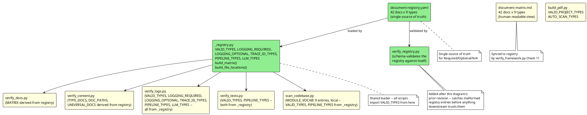

# Architecture Analysis — project_starter_v5

> Refreshed 2026-08-22. Previous revision described a 5-validator, pre-orchestrator snapshot of
> the framework and had drifted from the actual codebase — the orchestrator, adapter, skill, and
> telemetry layers below existed in code but not in this document. Rewritten from the current
> source tree, not from memory of the previous revision. Updated same day to add
> `llm_security_review.py` (`verify_security.py --llm-review`), `verify_workflow_registry.py`,
> the `_registry.py` per-type behavioural flag centralisation, and `framework_fix_agents.py`
> (`propose_framework_fix.py --ai-draft`) — all added after the initial rewrite.

## Current Architecture

The framework is four layers: **entry points** (how a project starts using it), **orchestration**
(how a task's validator sequence is decided), **verification** (the gates that actually run), and
**agent adapters + telemetry** (how the plan and its results reach an AI coding tool and get
recorded). 13 `verify_*.py` gates (9 always-on, 3 opt-in, 1 framework self-check), 3 LLM-wrapper
scripts (`semantic.py` and `llm_security_review.py`, each invoked from an opt-in gate;
`framework_fix_agents.py`, invoked from a framework support tool — see Multi-Agent Pipeline
below), 4 further framework support tools, 6 root-level orchestration/detection scripts, 7
Claude-facing Skills, and 2 agent adapters (Claude, Codex) as of this revision.

**Entry points** — run once per project, or on demand to re-classify:
- `detect_type.py` — infers project type from file layout / dependency manifests / free-text
  requirements; `--apply` writes the result straight into `.project-starter.yml`, alongside
  `project_type_confirmed: false` — a confidence threshold alone only catches a low-scoring
  guess, not a high-scoring one that's still wrong (mixed signals), so every `--apply` write
  is gated the same way regardless of confidence; `.githooks/pre-commit` blocks commits until
  it's flipped to `true`. Never written for a human-typed `project_type` — only gates a
  machine guess
- `init.py` (and `setup.sh --init`, which delegates to it for the bash-only path) — copies
  `templates/script/` → `docs/script/`, the matching `templates/init/<type>.md`, and
  `adapters/claude/skills/` → `.claude/skills/` into a fresh project

**Orchestration layer** — run at the start of every task:
- `orchestrator.py` — reads `.project-starter.yml` + `docs/current-state.md`, resolves the
  current task type, looks up the matching validator sequence in `workflow-registry.yaml`,
  invokes `build-context.py` internally, and writes `.ai/WORKFLOW.md` (a deterministic plan) plus
  an adapter-specific file (`adapters/claude/start-task.md` output, or the Codex equivalent) via
  `--adapter`. `_resolve_spec_code_bindings()` resolves `.project-starter.yml`'s
  `spec_code_bindings` list (multiple contracts) or the legacy single
  `spec_code_adapter`/`spec_code_spec`/`spec_code_src` trio into a uniform list, rendering one
  `verify_spec_code.py` invocation per binding — `.githooks/pre-commit` calls this same function
  via `python3 -c "from orchestrator import ..."` rather than re-parsing the YAML list in bash,
  so there is one resolution rule, not two that could drift apart
- `build-context.py` — reads the same config, queries `document-registry.yaml`, and writes
  `.ai/AI_CONTEXT.md`: an ordered list of exactly which docs to read for this task, so the agent
  doesn't infer scope from `AGENTS.md` prose
- `workflow-registry.yaml` — the single source for task_type → validator sequence (`feature`,
  `pipeline-stage`, `bug-fix`, `sprint-end`, `eval-run`, `iac-change`, `default`); orchestrator.py
  injects `--project-type` automatically and conditionally adds `--semantic`-adjacent gates
  (spec↔code, security, prose) only when their config keys are set in `.project-starter.yml`

**Verification layer** — always-on gates run at every `git commit` via `.githooks/pre-commit`:
- `verify_docs.py` — document presence and fill quality
- `verify_content.py` — spec content quality (per-doc checker functions)
- `verify_logs.py` — log documentation coverage
- `verify_tests.py` — test coverage and report currency
- `verify_module_docs.py` — module flow file coverage & quality
- `verify_index_coverage.py` — index-table ↔ per-item-file coverage
- `verify_acceptance.py` — functional requirements ↔ test coverage
- `verify_registry.py` — schema-validates `document-registry.yaml` itself
- `verify_workflow_registry.py` — schema-validates `workflow-registry.yaml` itself (script paths
  resolve, no empty `validators` list, a `default` entry exists); runs first in every sequence,
  same placement as `verify_registry.py`

**Verification layer — opt-in gates**, enabled per-project via `.project-starter.yml` keys, added
to the sequence by `orchestrator.py` only when configured:
- `verify_spec_code.py` (+ `_spec_code_adapters/`) — spec ↔ code drift, 20 registered framework
  adapters (fastapi, flask, express, django, click, typer, airflow, dagster, prefect, luigi,
  python_library, typescript, tool_schema, langchain, terraform, pulumi, ansible, react_native,
  flutter, swiftui); `--semantic` wraps any of these with `semantic.py`, an LLM-assisted pass for
  ambiguous field renames — opt-in only, explicitly excluded from `workflow-registry.yaml`
  sequences (developer-invoked analysis, not a commit gate)
- `verify_security.py` — SAST wrapper (bandit / eslint-plugin-security / Semgrep); `--llm-review`
  wraps it with `llm_security_review.py`, headlessly invoking Claude Code's `/security-review`
  Skill for the class of issue a pattern-matcher can't see — opt-in only, same exclusion from
  `workflow-registry.yaml` as `--semantic`
- `verify_prose.py` — Vale wrapper for prose-quality (vague wording, prose-form placeholders)

**Framework self-check / support tools** — run at sprint end or on demand:
- `verify_framework.py` — internal consistency of the framework itself
- `diagnose_spec.py` — classifies verify output → project-level vs framework-level gaps
  (rule-based: does the template already have the section — deliberately not an LLM call,
  see Multi-Agent Pipeline below for why)
- `propose_framework_fix.py` — opens PRs on project_starter_v5 for framework-level gaps;
  `--ai-draft` swaps the default placeholder for `framework_fix_agents.py`'s draft+review
  output — opt-in only, same exclusion from automated sequences as `--semantic` /
  `--llm-review`
- `build_pdf.py` — renders `docs/` to PDF via PlantUML
- `scan_codebase.py` — source tree → `codebase-map.md`

**Shared utilities:**
- `_verify_common.py` — `_is_placeholder`, `_section_body` (with `@overload` for the
  `str`/`list[str]` return split), `read_doc_profile()`
- `_workflow_utils.py` — task-type resolution, YAML loading, shared by `orchestrator.py` and
  `build-context.py`


```plantuml
@startuml current-architecture
!theme plain
skinparam componentStyle rectangle

package "entry points" {
  [detect_type.py]
  [init.py / setup.sh]
}

package "orchestration" {
  [orchestrator.py]
  [build-context.py]
}

package "always-on gates\n(.githooks/pre-commit)" {
  [verify_docs.py]
  [verify_content.py]
  [verify_logs.py]
  [verify_tests.py]
  [verify_module_docs.py]
  [verify_index_coverage.py]
  [verify_acceptance.py]
  [verify_registry.py]
  [verify_workflow_registry.py]
}

package "opt-in gates\n(config-gated)" {
  [verify_spec_code.py]
  [semantic.py] as semantic
  [verify_security.py]
  [llm_security_review.py] as llmreview
  [verify_prose.py]
}

package "agent adapters" {
  [adapters/claude/*]
  [adapters/codex/*]
  [.claude/skills/*]
}

package "telemetry" {
  [telemetry_writer.py]
  [_otel.py]
  database "logs/telemetry/*.json" as telemetry_files
}

database ".project-starter.yml" as config
database "workflow-registry.yaml" as wfreg
database "docs/" as docs

[detect_type.py] --> config : --apply writes project_type
[orchestrator.py] --> config
[orchestrator.py] --> wfreg : resolves validator sequence
[verify_workflow_registry.py] --> wfreg : schema-validates
[orchestrator.py] --> [build-context.py] : invokes internally
[orchestrator.py] --> [adapters/claude/*] : --adapter renders\nstart-task.md
[build-context.py] --> docs
[build-context.py] ..> ".ai/AI_CONTEXT.md"

[verify_docs.py] --> docs
[verify_content.py] --> docs
[verify_logs.py] --> docs
[verify_tests.py] --> docs
[verify_spec_code.py] --> semantic : --semantic wraps adapter
[verify_security.py] --> llmreview : --llm-review wraps it

[telemetry_writer.py] --> telemetry_files : task-run.json
[semantic] --> telemetry_files : token-usage.json\n(usage, cost, budget)
[llmreview] --> telemetry_files : security-review-usage.json\n(cost, duration, turns)
[_otel.py] ..> telemetry_files : dual-emit as OTel span\n(opt-in, OTEL_EXPORTER_OTLP_ENDPOINT)

note right of wfreg
  task_type -> validator list;
  opt-in gates added only when
  their .project-starter.yml
  key is set
end note

note right of semantic
  never appears in
  workflow-registry.yaml —
  developer-invoked, not a gate
end note

note right of llmreview
  same rule as semantic.py —
  developer-invoked, not a gate
end note
@enduml
```

---

## Dependency Graph — Hardcoded Project-Type Knowledge

Each node is a file. Red = encodes the primary document × type matrix. Yellow = encodes a subset
of that knowledge independently.


```plantuml
@startuml coupling-graph
!theme plain

rectangle "_registry.py\nVALID_TYPES, LOGGING_REQUIRED,\nLOGGING_OPTIONAL, TRACE_ID_TYPES,\nPIPELINE_TYPES, LLM_TYPES\nbuild_matrix()\nbuild_file_locations()" as reg #LightGreen
rectangle "document-registry.yaml\n42 docs x 9 types\n(single source of truth)" as yaml #LightGreen
rectangle "verify_registry.py\n(schema-validates the\nregistry against itself)" as vreg #LightGreen

rectangle "verify_docs.py\n(MATRIX derived from registry)" as vd #LightYellow
rectangle "verify_content.py\n(TYPE_DOCS, DOC_PATHS,\nUNIVERSAL_DOCS derived from registry)" as vc #LightYellow
rectangle "document-matrix.md\n42 docs x 9 types\n(human-readable view)" as dm #LightYellow

rectangle "verify_logs.py\n(VALID_TYPES, LOGGING_REQUIRED,\nLOGGING_OPTIONAL, TRACE_ID_TYPES,\nPIPELINE_TYPES, LLM_TYPES --\nall from _registry)" as vl #LightYellow
rectangle "verify_tests.py\n(VALID_TYPES, PIPELINE_TYPES --\nboth from _registry)" as vt #LightYellow
rectangle "build_pdf.py\nVALID_PROJECT_TYPES\nAUTO_SCAN_TYPES" as bp #LightYellow
rectangle "scan_codebase.py\n(MODULE_VOCAB: 9 entries, local --\nVALID_TYPES, PIPELINE_TYPES from _registry)" as sc #LightYellow

yaml --> reg : loaded by
yaml --> vreg : validated by
reg --> vd
reg --> vc
reg --> vl
reg --> vt
reg --> sc

note bottom of yaml : Single source of truth\nfor Required/Optional/N/A
note bottom of reg : Shared loader -- all scripts\nimport VALID_TYPES from here
note bottom of dm : Synced to registry\nby verify_framework.py Check 11
note bottom of vreg : Added after this diagram's\nprior revision -- catches malformed\nregistry entries before anything\ndownstream trusts them
@enduml
```

---

## Coupling Problem Catalogue

### Resolved

- **VALID_TYPES declared in four separate scripts** — `_registry.py` is the single source; all
  scripts import `VALID_TYPES` from it.
- **Document x type matrix encoded in three places** — `document-registry.yaml` is the single
  source; `verify_docs.py` / `verify_content.py` derive their local structures from it via
  `build_matrix()` / `build_doc_paths()`; `document-matrix.md` is kept in sync by
  `verify_framework.py` Check 11; `verify_registry.py` now schema-validates the registry itself.
- **Document file paths encoded in two places** — the registry's `path` field is the single
  source; moving a document requires one edit.
- **`.project-starter.yml`'s spec_code config had exactly one consumer... until it needed two** —
  `orchestrator.py` (Python, real YAML parsing) and `.githooks/pre-commit` (bash, `grep`/`sed`
  reading flat `key: value` lines) both need to resolve the same config into the same list of
  bindings. Adding `spec_code_bindings` (a YAML list) could easily have meant writing the
  resolution rule twice — once in Python, once re-implemented in bash regex over a nested
  structure bash was never a good tool for. Instead, `_resolve_spec_code_bindings()` lives once
  in `orchestrator.py`; the bash hook calls it via `python3 -c "from orchestrator import ..."`.
  One resolution rule, two callers — same shape as `_registry.py`'s `VALID_TYPES`, just crossing
  a language boundary instead of a file boundary. Caught a real bug doing it this way instead of
  duplicating the logic: `_load_yaml()` expects a `pathlib.Path`, not a raw string, and on native
  Windows Python's stdout text-mode `\n` → `\r\n` translation left a trailing `\r` stuck to each
  line's last field after bash's `read` — both would have been silent false-negatives (the gate
  just never firing, no error) had they shipped. Found by actually staging files in a throwaway
  git repo and watching the gate not fire, not by reading the code.
- **AI startup cost: project type resolved by inference** — `build-context.py` writes
  `.ai/AI_CONTEXT.md` as a deterministic ordered read list; `orchestrator.py` writes
  `.ai/WORKFLOW.md` as the broader task plan. Neither depends on the agent inferring scope from
  `AGENTS.md` prose.
- **A high-confidence `detect_type.py` guess had no confirmation gate, only a low-confidence
  refusal** — `--apply` already refused to write a *low*-scoring recommendation
  (`test_cli_apply_refuses_on_low_confidence`), but a *high*-scoring one that's still wrong
  (mixed signals — e.g. a data-pipeline project with a small internal FastAPI admin panel can
  genuinely score high for `web-app`) sailed straight through with nothing forcing anyone to
  actually check it. `--apply` now writes `project_type_confirmed: false` alongside `project_type`
  on every write, regardless of confidence; a new `.githooks/pre-commit` guard (same shape as the
  existing `Clarifying Questions Asked` guard — a boolean-ish field must be explicitly set before
  a commit that depends on it is allowed) blocks commits until it's `true`. A human typing
  `project_type` in by hand never triggers the field — `_mark_project_type_unconfirmed()` only
  runs inside `--apply`'s own write path, so a human decision is never retroactively made to look
  unconfirmed. Confirmed working end-to-end against a real git repo (field `false` blocks with the
  right message, `true` and field-absent both pass silently), not just unit-tested in isolation.
- **A technology decision made mid-conversation had no path into `research.md` except a human
  or the agent remembering, or the periodic `sprint-doc-sync` checklist item catching it later**
  — closed with two different mechanisms for two different moments, not one mechanism forced to
  cover both:
  - **The brand-new-project moment is deterministic** — `session-start-hook.sh` already checked
    `docs/current-state.md`'s Task field for the template placeholder; it now also checks whether
    `docs/specs/research.md` has any non-placeholder `**Decision:**` line. Both signals true
    together (not either alone — a task-in-progress project with an empty `research.md` doesn't
    need this every session) nudges toward discussing and recording key technology decisions
    before writing code. Deliberately looser than `verify_content.py`'s `check_research()` (skips
    the Rationale-entry check) — this is a non-blocking nudge, not the commit-time gate, so exact
    parity with the authoritative check isn't required.
  - **Every other moment is a judgment call, not a structural check** — no YAML shape or file-state
    signal can tell whether a given exchange in conversation was a technology decision. Confirmed
    by researching how other tools solve the same problem: the closest published equivalent
    (ECC's `architecture-decision-records` Skill) states outright that it "doesn't truly auto-detect
    in the autonomous sense" — it also relies on keyword/tone signals in conversation, not code.
    The `research-decision-log` Skill adopts the same shape (explicit triggers like "let's go with
    X", implicit ones like comparing libraries and landing on one) but keeps this framework's own
    fail-closed convention: draft the entry, ask before writing, never write without approval — same
    principle as `framework_fix_agents.py`'s review-agent gate and `--ai-draft`'s fallback-on-
    rejection behavior elsewhere in this document.
- **`current-state.md`'s Doc Checklist had the same "convention until something checks it" gap
  `Clarifying Questions Asked` used to have** — AGENTS.md's "Closing out a task" says apply each
  Doc Checklist item and check it off at closeout, but nothing verified that happened before a
  task was marked `Status: Complete`; a task could reach Complete with the checklist entirely
  unchecked, or still showing the raw, never-customized template placeholder
  (`` `docs/[relevant spec]` ``), and nothing would block the commit. A new guard in
  `.githooks/pre-commit`, triggered the same way as the pre-existing (previously untested)
  Closeout-completeness guard right above it in the script (`current-state.md` staged with Status
  containing "Complete"), checks the Doc Checklist section for a remaining `- [ ]` or the raw
  placeholder. Deliberately reuses the checklist's own checkbox state instead of adding a second
  summary field (e.g. `Doc Checklist Applied: Y/N/A`) — a separate field would just be one more
  thing that could say "done" without the underlying items being checked off; the checkboxes
  already are that record. Confirmed against a real git repo across all four states (unchecked
  item blocks, raw placeholder blocks, all-checked passes, `Status: In Progress` never triggers
  the check regardless of checklist state).
- **Every `.githooks/pre-commit` gate only fires at `git commit` — a workflow with infrequent
  commits means most of them rarely run** — `project_type_confirmed`, `Clarifying Questions
  Asked`, Doc Checklist completeness, the always-on `verify_*.py` checks: all of it is invisible
  until whenever a commit finally happens. `pretooluse_scope_guard.py` is the one gate that
  doesn't depend on commit frequency (fires per-edit); nothing covered the other three. A first
  attempt counted uncommitted files (`git status --porcelain`) against a 10-entry threshold and
  suggested committing in smaller increments — this models commit *frequency*, which breaks down
  for a workflow that pulls once, does a long stretch of local work, then pushes/merges once at
  the end: no threshold fires at a meaningful moment, and "commit smaller" isn't advice that fits
  a shared-branch pull-then-push-once habit. Replaced with the actual approach: `run-verify.sh`
  (Stop hook, already ran the four always-on validators and wrote `logs/verify-*.json` on every
  turn) now re-reads `.project-starter.yml` and `current-state.md` directly on every Stop event
  and re-runs the same checks `.githooks/pre-commit` performs on staged files — but against
  the working tree, since there's no staged-file concept outside a commit. Surfaced via
  `hookSpecificOutput.additionalContext` — confirmed Stop hooks support the identical schema
  `session-start-hook.sh` already uses for `SessionStart` before relying on it (not assumed; see
  https://code.claude.com/docs/en/hooks). Deliberately kept non-blocking, matching this hook's
  existing design — a second informational layer for what the one blocking, commit-independent
  gate (`pretooluse_scope_guard.py`) doesn't cover, not a new hard gate.
- **`sprint-change-log.md`'s 3-entry Sprint Documentation Sync trigger was pure convention — no
  hook or CI verified it actually happened.** The count trigger itself (AGENTS.md -> Sprint
  Documentation Sync: 3 entries at `Status: Pending documentation synchronization` → run
  `templates/sprint-sync.md`) was already documented, and the `sprint-doc-sync` Skill nudges
  Claude toward it by description match — but nothing blocked the Pending backlog from growing
  past 3, 4, 10 indefinitely if the nudge was ignored or the Skill never triggered. A new
  `.githooks/pre-commit` guard reads `sprint-change-log.md` directly (working-tree state, not
  staged — same approach as the `project_type_confirmed` guard, since what matters is whether the
  fix landed on disk, not which commit did it) and blocks every commit once the Pending count is
  `>= 3`, until sync marks entries `Documentation synchronized`. Mirrored into `run-verify.sh` as
  a fourth non-blocking Stop-hook check alongside the three above, for the same infrequent-commit
  reason. Surfaced during the same conversation that produced the file-count-threshold-to-direct-
  check redesign above — asking "what else here is convention-only, not actually enforced"
  surfaced this gap too, once the discussion moved from "commit" to "sprint" as the relevant unit.
- **The four working-tree Stop-hook checks above still missed the heaviest gates: `verify_docs
  --content`, `verify_logs`, `verify_tests`, `verify_content` `--strict` failures** — these only
  ever surfaced at `git commit` too. The fix cost nothing extra to run: `run-verify.sh` already
  invokes all four validators with `--json` on every Stop event to build `logs/verify-*.json` (a
  log nobody reads proactively), and reading each validator's own `main()` confirmed `--strict`
  only ever changes the exit code, never the JSON content — so the JSON already captured is
  sufficient to compute the identical pass/fail `--strict` would, just by parsing it (`status ==
  'missing_required'` for `verify_docs.py`, `status == 'fail'` for `verify_logs.py`/
  `verify_tests.py`, `not present or quality == 'fail'` for `verify_content.py`'s documents and
  modules — confirmed against each script's own `--strict` branch, not guessed). Deliberately
  excluded from this Stop-hook layer: `test_command` (would mean re-running the full test suite
  on every session end), spec↔code drift, security scan, and prose scan — these stay commit-time-
  only since they're either slow or need dependencies (Vale, bandit) not guaranteed to be present
  outside the commit path.
- **A local `.githooks/pre-commit` only ever protects the machine it's installed on — a teammate
  who never ran the manual install step, a fresh clone, or CI itself gets none of it.** The
  underlying block was structural, not a missing feature: every guard read `git diff --cached`
  (the staged index) and `git show ":$file"` (the staged version of a file's content) — concepts
  that only exist mid-`git commit`, not in a CI checkout, where the working tree already *is* the
  full state under test and there's no staging step at all. Rewriting the checks into a second,
  CI-native script was rejected — same rationale as the `spec_code_bindings` YAML-parsing decision
  earlier in this document: two implementations of the same rules drift, and only one of them is
  exercised by this project's own test suite. Instead, both the diff source (`STAGED`) and the
  content-read helper (a new `_content_at()` function, replacing five separate `git show ":$file"`
  call sites) branch on whether `PROJECT_STARTER_DIFF_RANGE` is set: unset, behavior is byte-for-
  byte what it was before (`git diff --cached` / staged content); set to a git ref range (e.g.
  `origin/main...HEAD`), `STAGED` becomes `git diff --name-only "$RANGE"` and content reads become
  a plain `cat` of the working-tree file. One script, one set of rules, runnable from a CI step by
  setting a single environment variable — confirmed against a real two-commit repo in both modes:
  local mode sees nothing once a change is fully committed with nothing staged; the same repo with
  `PROJECT_STARTER_DIFF_RANGE` set catches the violation the commit introduced, and picks up
  further *uncommitted* working-tree edits too (proving it reads the tree, not a git object).
  Branch protection — actually blocking merge on this check, not just showing a red X anyone can
  ignore — is a GitHub repository setting, out of reach of any script here; README documents it as
  a manual pairing step, the same "convention vs. enforcement" distinction this whole document
  keeps returning to.
- **Auto-installing the CI workflow the same way the pre-commit hook is auto-installed was tried,
  then deliberately reverted — the two are not the same kind of change.** First pass: `init.py
  --init`'s `if git_head.exists()` branch (already auto-installing the local pre-commit hook) also
  wrote `.github/workflows/verify.yml`, following the same never-overwrite discipline as `CLAUDE.md`
  and `.gitignore`. This was wrong the moment it was checked against the actual use case driving
  this whole CI thread: the user's team situation is "other people also connect to this project,
  and I don't want to impose anything on them" — not "other people should be blocked from merging
  bad code." A local `.git/hooks/pre-commit` only ever affects the person who installed it; a file
  at `.github/workflows/*.yml` is picked up by GitHub Actions the moment it's merged and runs on
  *every* contributor's PR from then on, whether or not they use this framework or agreed to it —
  visible to them even without a branch-protection rule making it block anything. Auto-writing it
  is a fundamentally different blast radius than auto-installing a local hook, and doesn't belong
  behind the same unconditional `if git_head.exists()` check. Reverted to: the workflow content
  lives at `templates/ci/github-actions-verify.yml`, copied into a target project by `--init` like
  any other reference template (inert there — GitHub Actions only reads `.github/workflows/`, and
  this repo's own CI lives at `.github/workflows/ci.yml`, unaffected), but never installed into
  `.github/workflows/` automatically. Copying it there — the one action that actually activates
  it — is left as a deliberate, repo-owner decision, documented in README rather than defaulted
  into. Branch protection remains what it always was: a manual, one-time GitHub Settings step for
  whoever owns the target repo, for if and when they decide repo-wide enforcement is what they
  actually want.
- **`--semantic` / `--llm-review` / `--ai-draft` are opt-in by design (see the header comments in
  `verify_spec_code.py` / `verify_security.py` / `workflow-registry.yaml`), but nothing ever
  surfaced that they exist at the moment they'd actually be useful — purely on the human to
  remember.** Closed the same way Sprint Documentation Sync's 3-entry trigger works (a cheap,
  already-computed signal decides whether to nudge), for two of the three (`--ai-draft`'s closest
  analog, the self-improving loop's Step 4 decision gate in `templates/sprint-sync.md`, already
  existed before this). `verify_security.py`'s version was straightforward: its trigger signal
  already exists in the tool's own output with no invention needed — `print_report()` now prints a
  non-blocking `[TIP]` suggesting `--llm-review` whenever the scan finds at least one `medium`+
  severity finding and `--llm-review` wasn't already passed in that same invocation, reusing
  severity the scan already computed. `verify_spec_code.py`'s `--semantic` was the harder case: a
  fuzzy "these field names look semantically close" heuristic was considered and rejected — a
  self-invented heuristic there risks the exact failure mode this framework keeps avoiding
  elsewhere, wrong often enough to either spam false suggestions or silently miss real drift.
  Replaced with a purely quantitative signal instead: `_changed_lines_in_src()` shells out to
  `git diff --numstat HEAD -- <src>` and sums changed lines; `print_report()` suggests `--semantic`
  only when the structural comparison found a clean pass (no field added/removed/retyped) *and*
  that line count is >= 20 — a structural pass only confirms field names/types didn't change, it
  says nothing about behavior inside an unchanged signature, which is exactly what a large diff
  with zero structural findings hints might be worth a second, semantic look. Returns `None` (never
  a false trigger) outside a git repo or if the `git` command fails, so the tip only ever fires on
  a signal it's actually sure about. Both are the same non-blocking `[TIP]` pattern
  `.githooks/pre-commit` already uses three times (spec↔code / security-scan / prose-scan coverage
  tips) for exactly this "you have a capability configured but aren't using it" situation.
  Deliberately plain `print()` calls in the validator scripts themselves, not an AGENTS.md
  instruction telling Claude to ask — an instruction only fires if whatever tool is committing
  happens to be an LLM agent that read and followed it; a line the validator itself prints fires
  for any tool, any human, every time the condition is met, matching every other "convention →
  real, tool-agnostic signal" upgrade in this document.
- **Validator sequencing (`workflow-registry.yaml`) had no equivalent schema gate** —
  `verify_registry.py` validated `document-registry.yaml`'s shape, but nothing validated
  `workflow-registry.yaml`'s shape the same way (a validator script path that doesn't exist, a
  task type with an empty sequence, a missing `default` fallback). `orchestrator.py` used to fail
  at invocation time instead of at a dedicated check. `verify_workflow_registry.py` now closes
  this the same way `verify_registry.py` closed it for `document-registry.yaml`. Confirmed by
  actually running it against a deliberately broken copy of the registry (bad script path, empty
  `validators` list, missing `default`, unknown field) and checking it reported all four, not
  just by reading the check logic.
- **Per-type behavioural flags scattered across scripts** — re-auditing this item (carried over
  from the prior revision as unresolved) found it was half-stale: `verify_content.py`'s
  `UNIVERSAL_DOCS` was already derived from `document-registry.yaml` via `_registry.py`'s
  `get_universal_docs()` — an earlier, undocumented fix. The real remaining problem was
  `verify_logs.py`'s `LOGGING_REQUIRED` / `LOGGING_OPTIONAL` / `TRACE_ID_TYPES` / `PIPELINE_TYPES`
  / `LLM_TYPES` and `verify_tests.py`'s `PIPELINE_TYPES` — independently declared, with
  `PIPELINE_TYPES` a literal duplicate across the two files — plus `scan_codebase.py` re-writing
  the same `data-pipeline`/`ml-pipeline` pairing as an inline tuple instead of importing it. All
  five sets now live in `_registry.py` (frozensets, same placement as `VALID_TYPES`); the three
  scripts import them instead of declaring locally. Confirmed by asserting
  `verify_logs.PIPELINE_TYPES is verify_tests.PIPELINE_TYPES` (the same object, not
  coincidentally-equal duplicates) and by running the full test suite (`pytest tests/`) — this
  touches `_registry.py`, imported by nearly every validator, so a full run rather than only the
  directly-affected tests' was the right bar here. Regenerating `orchestrator.py`'s golden/snapshot
  fixtures for the earlier `verify_workflow_registry.py` addition (previous entry, this section)
  surfaced a real bug this same full-suite run caught: `orchestrator.py`'s `_render()` had a
  hardcoded exclusion list for scripts that don't accept `--project-type`
  (`verify_registry.py`, `verify_index_coverage.py`) that `verify_workflow_registry.py` was never
  added to — every generated command for it would have crashed with "unrecognized arguments" the
  first time anyone actually ran their `.ai/WORKFLOW.md`. Fixed in the same pass.

### Open

- **`_PRICING_PER_M_TOKENS` duplicated across `semantic.py` and `framework_fix_agents.py`** —
  same three-model USD/1M-token table, independently declared in each file (see Telemetry &
  Token Accounting). Two copies of small, stable data was a deliberate tradeoff when
  `framework_fix_agents.py` was added — `templates/script/generators/` and
  `templates/script/validators/_spec_code_adapters/` are independent `sys.path` roots, so
  centralising would mean a cross-package import for three dict literals. Worth revisiting if a
  third opt-in LLM call site is added: at that point the duplication is the same shape as the
  `PIPELINE_TYPES` problem resolved above, not a one-off.
- **The Writing Audience guard only ever checked `audience: external` documents — a task-plan
  narrative leaking into an `audience: internal` spec (e.g. `api-contract.md`) had zero
  protection.** Surfaced by actually using the framework as intended: implementing a real feature
  against `api-contract.md`, and noticing the spec kept growing with per-task planning content
  instead of staying a clean description of the current contract. `audience` in
  `document-registry.yaml` was never a statement about whether task/sprint narrative is
  acceptable — it only ever meant "is this included in the generated stakeholder PDF." The two
  concerns had been conflated: `current-state.md`'s Steps section and `sprint-change-log.md` are
  deliberately *not* in the registry at all — that's where per-task planning and historical
  implementation notes belong — so every document that *is* registered, `internal` or `external`
  alike, should carry none of that. Fixed by reading every document's `path` from
  `document-registry.yaml` dynamically at guard time (same `_load_yaml()` import pattern already
  used for `_resolve_spec_code_bindings()`) instead of a second, hand-maintained list of
  "spec-facing" filenames that had silently fallen out of sync with the registry's own audience
  field. Confirmed against a real repo: a `Sprint 3` / `Task 42` reference in `api-contract.md`
  now blocks the commit (previously invisible to this guard entirely); `architecture.md`
  (`audience: external`, the guard's original scope) still blocks the same way; `current-state.md`
  and `sprint-change-log.md` — deliberately absent from the registry — are confirmed still exempt,
  since flagging them would break the very place this content is supposed to live.
- **The registry-driven rewrite above silently dropped coverage for `modules/[module]/[module]-
  module-data-flow.md` — a real regression, caught before it shipped, not after.** The old
  hardcoded regex included `modules/.*-module-data-flow\.md$` as one of its four patterns; the new
  registry-driven list only matches *fixed* paths read from `document-registry.yaml`, and this
  entire family (the index `modules/module-data-flow.md` plus one file per module, name unknown
  until the module exists) was never registered there at all — an open-ended set can't be, its
  membership isn't fixed. Checking systematically for every other document family with the same
  shape (an index file that *is* registered, per-item files under it that aren't) found three more,
  none of which the old regex covered either: `modules/[module]/[module]-flow.md`,
  `business/[object-name]-object.md`, `business/[process-name]-process.md`,
  `specs/prompts/[id]-prompt.md`. Fixed by keeping the registry-driven list for fixed-path
  documents and adding a supplementary pattern match for all four open-ended families back in,
  deduped against the registry list (a per-module data-flow file, for instance, matches both) so a
  violation is never reported twice. Confirmed against a real repo for all four families, including
  the specific dedup case (`business/business-process.md` is simultaneously the registered index
  *and* matches the per-item `.*-process\.md$` pattern) reported exactly once, not twice.
- **Nothing detected when a spec changed out from under an already-scoped task's Steps.** Compared
  against GitHub Spec Kit's explicit design (plan/tasks are derived from the spec and regenerated
  when it changes — manual edits to the derived artifact are lost on purpose, because they should
  have been spec edits) this framework had no equivalent at all: `current-state.md`'s Steps are
  written once at task setup and never re-validated against the spec they were planned from. Full
  auto-regeneration was rejected as out of scope — silently rewriting a human's task plan without
  asking discards manual content the same way Spec Kit's model does, but every other opt-in/nudge
  decision in this document has been "detect and surface," never "silently overwrite," and there
  is no reason to break that pattern here just because Spec Kit's own answer is more aggressive.
  `session-start-hook.sh` now compares git commit timestamps: `current-state.md`'s own last commit
  against each file listed under its Required Context section (the same file list already read
  elsewhere for `.ai/AI_CONTEXT.md`); a Required Context file committed more recently is
  surfaced as a non-blocking `SessionStart` nudge, the same commit-timestamp-comparison mechanism
  `learning_log_nudge.py` already uses for `task-log.md` vs `learning-log.md`. Placeholder Required
  Context lines (the template's own `docs/[relevant file]`) and placeholder Tasks are excluded
  from the check the same way the rest of this hook already excludes them. Confirmed against a
  real repo in both directions: a spec committed after `current-state.md` triggers the nudge with
  the specific file named; `current-state.md` committed after the spec (the common case — e.g.
  checking off a Step) stays silent.

---

## Agent Adapter Layer

Two adapters exist, both consumed by `orchestrator.py --adapter <name>`:

| Adapter | Output | Mechanism |
|---|---|---|
| `claude` | `adapters/claude/start-task.md` template, rendered with the current workflow snapshot | `.claude/skills/` (7 Skills: code-quality-check, learning-checkpoint, module-completion-check, research-decision-log, retrofit-existing-project, sprint-doc-sync, task-closeout — copied into new projects by `init.py`); `pretooluse_scope_guard.py` (blocks edits outside the scoped Current Task); `session-start-hook.sh` / `stop-hook.sh` (session boundary hooks); `learning_log_nudge.py` |
| `codex` | `adapters/codex/task-instructions.md` | `setup.md` for one-time environment setup |

`orchestrator.py` embeds both adapters' templates directly (`_ADAPTER_TEMPLATES`) so `--adapter`
works from a plain copy of `orchestrator.py` with no `adapters/` directory present —
`tests/contract/test_adapter_contracts.py` guards the embedded copies against drifting from the
files in `adapters/`.

`add-framework-adapter` (`.claude/skills/`, not `adapters/claude/skills/`) is deliberately kept
framework-repo-only — it's the skill for building a *new* adapter, not one a downstream project
using the framework needs.

---

## Multi-Agent Pipeline: Framework Self-Fix

`diagnose_spec.py -> propose_framework_fix.py` was already a two-stage pipeline before this
section existed — diagnosis, then a fix — but both stages were rule-based: classify by whether
the template has the section, then insert a hardcoded placeholder comment. `--ai-draft` makes the
second stage a genuine two-agent LLM handoff, via `framework_fix_agents.py`:

```
diagnose_spec.py                         (rule-based — see below for why this stays that way)
  classify: project-level vs framework-level gap
        |
        v  (framework-level gap only, --ai-draft passed through)
propose_framework_fix.py --ai-draft
        |
        v
framework_fix_agents.run_ai_draft_pipeline()
        |
        +-- draft_fix()   [Agent 1]  Claude drafts real guidance prose for the missing
        |                            section, given the gap description + the template's
        |                            existing content for style/structure reference
        |
        +-- review_fix()  [Agent 2]  a *separate* Claude call grades the draft against
        |                            this framework's own prose-quality bar (the same
        |                            vague-wording / placeholder-language patterns
        |                            verify_prose.py's Vale rules catch in real docs) —
        |                            approve or reject, fails closed on any error
        |
        v
  approved -> drafted text goes into the PR
  rejected, no ANTHROPIC_API_KEY, draft/review call failed, or token budget exceeded
        -> falls back to the placeholder (never a worse PR than the default)
```

**Why two agents, not one call that drafts-and-checks-itself:** the draft agent's job is to write
something useful; the review agent's job is to be skeptical of it. A single call grading its own
output in the same turn is a weaker check than a fresh pass whose entire prompt is "find problems
with this" — the same reason a second human reviewer catches things a self-review misses. This
is a small, honest instance of the pattern, not a dressed-up single LLM call: `draft_fix()` and
`review_fix()` are two separate `messages.create()` calls with different prompts and different
jobs, confirmed by the self-test asserting `mock_client.messages.calls == 2` for an approved run.

**Why `diagnose_spec.py`'s own classification stays rule-based:** "does the template already
contain this section" is a structural yes/no question a string check answers exactly; an LLM
judgment call there would be strictly less reliable for zero benefit. Not every step in an
agent pipeline needs to be an agent — using an LLM only where judgment is actually required (is
this draft good enough) and staying deterministic where a fact can just be checked (does this
heading exist) is itself the design decision worth defending, not a gap to fill in later.

**Constraint, same as `--semantic` / `--llm-review`:** `--ai-draft` must never appear in
`workflow-registry.yaml` or a pre-commit sequence — it makes real LLM calls, its output is
non-deterministic, and `diagnose_spec.py` / `propose_framework_fix.py` aren't wired into
`workflow-registry.yaml` at all today (sprint-end / on-demand tools only), so this is a
docs-level constraint rather than one currently enforced by a config check the way the other
two are.

---

## Telemetry & Token Accounting

Five JSON logs under `logs/telemetry/`, each append-only, each best-effort (never raises on
write failure):

| File | Written by | Content |
|---|---|---|
| `task-run.json` | `adapters/claude/telemetry_writer.py`, called by `stop-hook.sh` | `ts`, `task`, `adapter`, `orchestrator_runs` — one row per Claude Code session boundary |
| `skip-verify.json` | pre-commit, when `PROJECT_STARTER_SKIP_VERIFY` bypasses the gates | `ts`, `staged_files` — the bypass still prints a loud `[SKIP]` line; this is in addition, not instead |
| `token-usage.json` | `semantic.py`, after every `semantic_compare()` call | `ts`, `model`, `calls`, `input_tokens`, `output_tokens`, `estimated_cost_usd`, `budget_tokens`, `budget_exceeded` |
| `security-review-usage.json` | `llm_security_review.py`, after every `run_llm_security_review()` call | `ts`, `cost_usd`, `duration_ms`, `num_turns` — whatever fields the installed Claude Code version's `--output-format json` reports; read defensively, never assumes the schema |
| `framework-fix-agents-usage.json` | `framework_fix_agents.py`, after every `run_ai_draft_pipeline()` call | `ts`, `model`, `calls` (2 when both agents ran, 1 if the draft agent failed before review), `input_tokens`, `output_tokens`, `estimated_cost_usd`, `budget_tokens`, `budget_exceeded` |

`token-usage.json`, `security-review-usage.json`, and `framework-fix-agents-usage.json` are the
only three backed by a real LLM response rather than local state — `semantic.py`,
`llm_security_review.py`, and `framework_fix_agents.py` are the framework's only three call sites
for a live LLM call (`--semantic` on `verify_spec_code.py`, `--llm-review` on `verify_security.py`,
`--ai-draft` on `propose_framework_fix.py`), so they're also the only places able to report
*measured* usage instead of an estimate. `semantic.py` and `framework_fix_agents.py` both check
accumulated `input_tokens + output_tokens` against an optional per-tool budget env var
(`SPEC_CODE_TOKEN_BUDGET`, `FRAMEWORK_FIX_TOKEN_BUDGET`) before firing, stop mid-run when the
budget is hit, and price the total from a small per-model USD/1M-token table — two independent
copies of the same small table (`_PRICING_PER_M_TOKENS` in each file), not centralised; see this
document's own Coupling Problem Catalogue for the kind of thing that becomes worth centralising
once a third caller needs it. `llm_security_review.py` has no equivalent budget cap — a single
`/security-review` invocation is one call, not a loop over multiple ambiguous field pairs or a
two-agent handoff, so there is nothing to cap mid-run.

`_otel.py` optionally dual-emits every one of these writes as an OpenTelemetry span
(`OTEL_EXPORTER_OTLP_ENDPOINT` set + `opentelemetry-*` installed; no-op otherwise), including
hand-rolled cross-process trace propagation — each validator/orchestrator invocation is a separate
Python process, so the root span's `trace_id`/`span_id` are persisted to
`logs/telemetry/.otel_trace_context.json` and reconstructed as a parent context on the next call
for the same task, rather than relying on OTel's in-process parent/child tracking.

---

## Responsibility Boundaries (current)

| Concern | Owner | Status |
|---|---|---|
| Valid type list | `_registry.py` -> imported by all scripts | Centralised |
| Document -> type mapping (R/O/N) | `document-registry.yaml` -> `build_matrix()` | Centralised |
| Document -> path mapping | `document-registry.yaml` -> `build_file_locations()` / `build_doc_paths()` | Centralised |
| Registry shape validity | `verify_registry.py` | Guarded |
| Human-readable matrix | `document-matrix.md` synced by Check 11 | Guarded |
| Per-type behavioural flags | `_registry.py` (`LOGGING_REQUIRED`, `LOGGING_OPTIONAL`, `TRACE_ID_TYPES`, `PIPELINE_TYPES`, `LLM_TYPES`) -> imported by `verify_logs.py`, `verify_tests.py`, `scan_codebase.py`; `UNIVERSAL_DOCS` via `get_universal_docs()` | Centralised |
| Task startup context | `build-context.py` -> `.ai/AI_CONTEXT.md` | Implemented |
| Task validator sequence | `workflow-registry.yaml` -> `orchestrator.py` -> `.ai/WORKFLOW.md` | Implemented; guarded by `verify_workflow_registry.py` |
| Agent-specific task instructions | `adapters/<tool>/` templates, embedded in `orchestrator.py`, drift-guarded by `test_adapter_contracts.py` | Implemented |
| Session/task telemetry | `telemetry_writer.py`, `_otel.py` | Implemented |
| Real LLM token/cost accounting (spec<->code) | `semantic.py` -> `logs/telemetry/token-usage.json` | Implemented |
| Real LLM cost/duration accounting (security review) | `llm_security_review.py` -> `logs/telemetry/security-review-usage.json` | Implemented |
| Real LLM token/cost accounting (framework self-fix) | `framework_fix_agents.py` -> `logs/telemetry/framework-fix-agents-usage.json` | Implemented |
| Framework-level gap draft + review (multi-agent) | `propose_framework_fix.py --ai-draft` -> `framework_fix_agents.py` (draft agent + review agent) | Implemented; see Multi-Agent Pipeline section |
