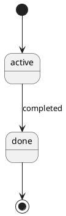

# PDF generation

> Moved out of README.md to keep the top-level quickstart/reference shorter — nothing
> outside this repo links to this file by section anchor, so it was safe to relocate.
> See README.md's table of contents for where this fits among the other reference docs.

## Setting up PlantUML

All UML diagrams use [PlantUML](https://plantuml.com) syntax (` ```plantuml ` blocks).
`build_pdf.py` renders them automatically — no separate steps needed once PlantUML is installed.

**Quick setup (recommended):**
```bash
bash setup.sh   # downloads plantuml.jar and checks Java
```

**Manual setup:**
1. Java (JDK 11+): `java -version`
2. PlantUML jar: download from https://plantuml.com/download and place at `docs/script/generators/plantuml.jar`
   Or set the environment variable: `export PLANTUML_JAR=/path/to/plantuml.jar`

> **If plantuml.jar is missing**, `build_pdf.py` will produce a PDF **without diagrams** and print
> a warning — it does not abort. The warning message now points to `setup.sh` for a quick fix.

**Diagram syntax:** write your diagram inside a ` ```plantuml ` block in any `.md` file:
```


## Generating the merged PDF

Combines every real document under `docs/` (per the allowlist in `pdf_allowlist.py`) into a
single PDF — table of contents, page numbers, and diagrams embedded as images
with a clickable link to the original interactive HTML.

```bash
pip install markdown weasyprint cairosvg --break-system-packages

# System spec PDF (stakeholder handoff)
python3 docs/script/generators/build_pdf.py docs --lang en --project-type data-pipeline --content spec

# Full PDF — all six chapters including Plan and Test (for internal use)
python3 docs/script/generators/build_pdf.py docs --lang en --project-type data-pipeline -o docs/project-documentation-en.pdf

# Hybrid project — both comma (,) and plus (+) are accepted as separators
python3 docs/script/generators/build_pdf.py docs --lang en --project-type data-pipeline,web-app -o docs/project-documentation-en.pdf
python3 docs/script/generators/build_pdf.py docs --lang en --project-type data-pipeline+web-app -o docs/project-documentation-en.pdf

# No type filter — include all files that exist (backward-compatible)
python3 docs/script/generators/build_pdf.py docs --lang en -o docs/project-documentation-en.pdf
```

> **Hybrid type separator:** `build_pdf.py` accepts both `,` and `+` (e.g. `data-pipeline,web-app` or
> `data-pipeline+web-app`). `verify_docs.py` uses `+` only. AGENTS.md declarations also use `+`.
> Use whichever matches the tool you're calling.

> **`--lang zh` scope:** `--lang zh` translates section headers, the table of contents, and the
> "How to Use" page into Traditional Chinese. **Template file content** (placeholders and comments
> inside each `.md` file) remains in English because all templates are English-only. If you need
> fully localized template content, maintain a `docs-zh/` mirror and translate the template files
> before running `build_pdf.py docs-zh --lang zh`.

`--content spec` omits Plan (project-plan, changelog) and Test (test-plan, test-report) chapters — use this when handing off the spec to stakeholders or clients. Default (`full`) includes all six chapters.

To add a new document to the PDF, add it to **`docs/script/generators/pdf_allowlist.py`** only —
`build_pdf.py` imports from it automatically. Note that
`business/*-process.md`, `business/*-object.md`, `modules/*/*-module-data-flow.md`,
and `specs/prompts/*-prompt.md` are auto-scanned and do not need to be added manually.

