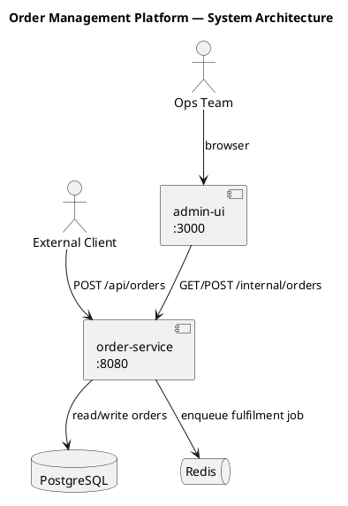

# Architecture

## Overview

Two-service system: `order-service` (backend API) and `admin-ui` (React SPA). The admin-ui
communicates with order-service via internal REST endpoints secured by a shared service token.
External clients use the public REST API on order-service.

## System Components

| Component | Type | Responsibility |
|---|---|---|
| order-service | REST API (Node.js/Express) | Order lifecycle management, persistence |
| admin-ui | SPA (React/Vite) | Operations dashboard |
| PostgreSQL | Database | Order and customer data |
| Redis | Cache / Job queue | Status event queue for async fulfilment |

## Data Flow

