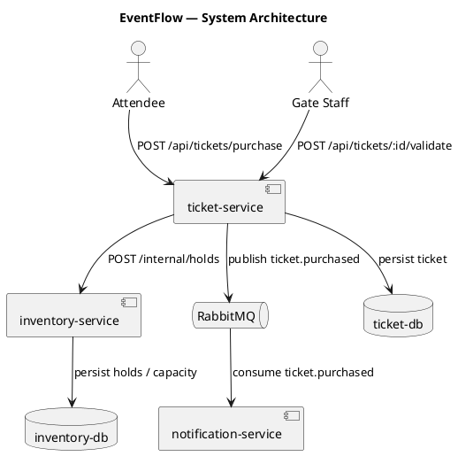

# Architecture

## Overview

EventFlow is a three-service ticketing platform. `ticket-service` owns purchases and
validation, `inventory-service` owns per-event seat/ticket-type capacity, and
`notification-service` sends purchase confirmations and reminders. Services communicate
synchronously via REST for the purchase path and asynchronously via a message broker for
post-purchase notifications.

## System Components

| Component | Type | Responsibility |
|---|---|---|
| ticket-service | REST API (Node.js/Express) | Ticket purchase, validation, gate scanning |
| inventory-service | REST API (Go) | Seat/ticket-type capacity, holds, releases |
| notification-service | Worker + REST API (Python) | Consumes purchase events, sends email/SMS |
| Message Broker | RabbitMQ | Delivers `ticket.purchased` events to notification-service |
| PostgreSQL (per service) | Database | Each service owns its own schema — no shared DB |

## Data Flow

