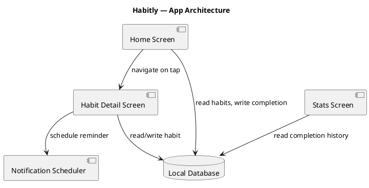

# Architecture

## Overview

Habitly is a single-user, offline-first Flutter app. All state lives in a local SQLite
database on the device; there is no backend service and no network calls in v1.

## System Components

| Component | Type | Responsibility |
|---|---|---|
| Home Screen | Flutter widget | Lists active habits, one-tap mark-done |
| Habit Detail Screen | Flutter widget | Edit a habit, view its streak history |
| Stats Screen | Flutter widget | Weekly/monthly completion charts |
| Local Database | sqflite (SQLite) | Persists habits and daily completion records |
| Notification Scheduler | flutter_local_notifications | Schedules and delivers reminder notifications |

## Data Flow

