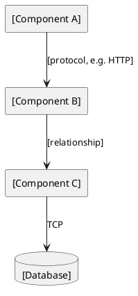
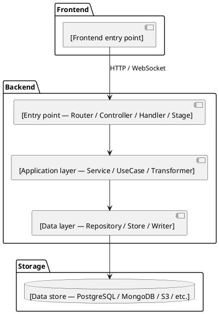

# Architecture

<!--
  Describes system component overview and data flow.
  Contains ```plantuml component diagram blocks rendered automatically by build_pdf.py.

  Code layering / module patterns → backend.md, frontend.md (same folder)
  Database entity relationships (conceptual) → database.md (same folder)
  Deployment environment details → deployment.md (same folder)
-->

## Overview

[Brief description of the system architecture, covering main components and core data flow. 2-4 sentences.]

---

## System Components

<!--
  List every runtime component in the system.
  Type is a free-form label — use whatever best describes the component's role.
  Common values: gateway, service, worker, frontend, mobile, cli,
                 database, cache, queue, storage, third-party, iot-device
  You are not limited to these — use any label that is clear and accurate.
-->

| Component | Type | Responsibility | Protocol |
|---|---|---|---|
| [component name] | [type] | [responsibility] | [e.g., HTTP / gRPC / TCP / AMQP / WebSocket] |
| [component name] | [type] | [responsibility] | [protocol] |

---

## Data Flow

### Main Path
1. [Component A] → [Component B]: [description]
2. [Component B] → [Component C]: [description]

### Async Path
1. [Component A] → [Queue / Event Bus]: [event sent]
2. [Queue / Event Bus] → [Component B]: [event consumed]

### Error Path
1. [error scenario] → [how the component handles it]

---

## System Architecture Diagram

<!--
  `type` is a free-form string used only for visual grouping in the diagram.
  Use any value that accurately describes the component's role.

  Common type values and their typical visual treatment:
    gateway       — entry point, shown at the edge
    service       — core application logic
    worker        — background processing
    frontend      — browser or mobile client
    cli           — command-line interface
    database      — persistent data store
    cache         — in-memory store
    queue         — message broker / event bus
    storage       — file or object storage (S3, GCS, etc.)
    third-party   — external service (Stripe, Twilio, etc.)

  Add communicates_with only for direct calls — not transitive dependencies.
  protocol is optional; omit if not meaningful for this component.
-->



<!--
  Deployment environment details (services, env vars, startup flow, build/deploy flow)
  belong in deployment.md (same folder) — not duplicated here.
-->

---

## System Component Structure

<!--
  Describes the code-level component structure of the whole system.
  Fill in based on the actual layers described in:
    - docs/architecture/frontend.md  → replace Frontend group with actual layers
    - docs/architecture/backend.md   → replace Backend group with actual layers
    - docs/architecture/database.md  → replace DB component with actual data store

  Use the actual layer names from those documents — not generic placeholders.
  Add or remove component blocks to match your real architecture.
  Not all systems have a frontend — remove that group if not applicable.
  Some systems have multiple backends or no clear layering — adapt freely.

  After writing, run: Edit the ```plantuml block in the file, then rebuild PDF
-->


