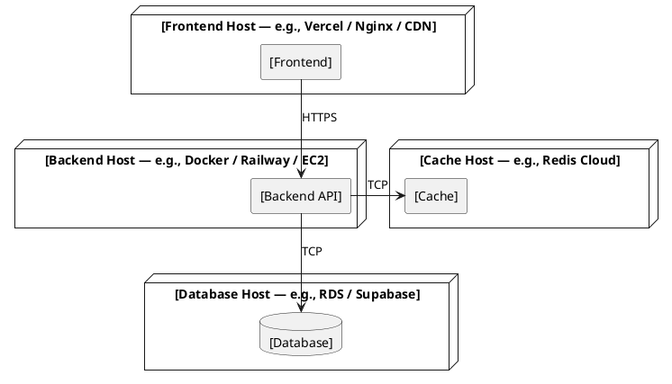

# architecture/deployment.md

Purpose:
Describe runtime structure — how to run this system locally and how to deploy it.

Include:
- Services
- Environment variables
- Local startup flow
- Build/deploy flow
- Verification steps

Avoid:
- Business requirements
- Feature details

---

## Services

<!--
  List every service that needs to be running for the system to work.
  Port is optional — omit if not applicable (e.g. serverless, managed services).

  Examples:
    frontend    React / Vite          5173   serves the UI
    backend     Express / Node.js     4000   REST API
    database    PostgreSQL 16         5432   primary data store
    cache       Redis 7               6379   session and query cache
    queue       RabbitMQ              5672   async job queue
    worker      BullMQ worker         —      processes background jobs
    storage     MinIO (S3-compatible) 9000   file uploads (local only; S3 in prod)
-->

| Service | Technology | Port | Description |
|---|---|---|---|
| [service name] | [technology and version] | [port or —] | [description] |

---

## Environment Variables

<!--
  List every environment variable the system reads.
  Remove DATABASE_URL and JWT_SECRET if your project does not use them —
  these are examples, not requirements.
  Add all variables your project actually uses.
-->

| Variable | Required | Description | Example |
|---|---|---|---|
| `[VAR_NAME]` | ✅ | [what it controls] | `[example value]` |
| `[VAR_NAME]` | ❌ | [what it controls, and what the default is] | `[example value]` |

Copy `.env.example` to `.env` and fill in the values before starting.

---

## Local Startup Flow

<!--
  List the exact commands to get the system running locally.
  Adapt to whatever tools and package manager this project uses.
  Remove steps that don't apply (e.g. no migrations for a document DB).

  Common patterns:
    Docker Compose:   docker compose up -d
    Node.js:          npm install / pnpm install / yarn
    Python:           pip install -r requirements.txt / poetry install
    Go:               go mod download
    Ruby:             bundle install
    Migrations:       prisma migrate dev / rails db:migrate / alembic upgrade head / go run ./cmd/migrate
    Dev server:       npm run dev / python manage.py runserver / go run . / rails server
-->

Prerequisites:
- [required tools and versions, e.g., Docker Desktop, Node.js 22+, Python 3.12+]

```bash
# 1. [Step description]
[command]

# 2. [Step description]
[command]

# 3. [Step description]
[command]
```

Expected state when running:
- [service] available at [URL or description]
- [health check command and expected output]

---

## Build / Deploy Flow

<!--
  Describe how to build and deploy the system.
  Adapt to whatever CI/CD and hosting platform this project uses.

  Examples:
    docker compose build && docker push myapp:latest
    pnpm build → deploy to Vercel via git push
    go build -o bin/server → rsync to VPS
    railway up
    fly deploy
    kubectl apply -f k8s/
    serverless deploy
    eb deploy
-->

### Build

```bash
[build command(s)]
```

### Deploy

```bash
[deploy command(s)]
```

### Environments

| Environment | URL | Notes |
|---|---|---|
| Local | `http://localhost:[port]` | [local setup description] |
| Staging | `[URL]` | [hosting platform] |
| Production | `[URL]` | [hosting platform] |

---

## Verification

How to confirm the system is running correctly after startup.

- [ ] **[What to verify]**
  Run: `[exact command]`
  Expected: `[exact output]`

---

## Cache Policy

<!--
  Include this section if any layer of the system uses caching (Redis, in-memory, CDN, etc.).
  Remove it if the system has no caching layer.

  For every cache key or layer, document:
  - TTL: how long cached data is considered fresh
  - Invalidation trigger: what causes the cache to be cleared before TTL expires
  - Boundary handling: what happens when a write occurs within the TTL window

  Boundary conditions are mandatory — "stale reads possible" is not enough.
  The consumer (frontend, downstream service) must know what to do when it detects stale data.
-->

| Key / Layer | TTL | Invalidation trigger | Boundary handling |
|---|---|---|---|
| `[cache key or layer name]` | [e.g., 2s] | [e.g., write to DB, explicit flush] | [e.g., stale reads possible for up to TTL after write; consumer retries on state mismatch] |

**Boundary conditions:**

| Scenario | Expected behaviour | Consumer action |
|---|---|---|
| Write occurs within TTL window | Cache may serve stale data for up to [TTL] | [e.g., poll again after TTL / show loading state / use optimistic UI] |
| Cache miss | [e.g., read-through from DB / return 503] | [e.g., retry with backoff] |
| Invalidation fails | [e.g., stale entry persists until TTL expires] | [e.g., force-refresh button / automatic retry] |

---

## Service-Specific Gotchas

<!--
  Record non-obvious behaviours for each service — things that would cause silent failures
  or hard-to-debug errors if assumed incorrectly.

  For each gotcha, document:
  - The assumption that is easy to make (and wrong)
  - The actual behaviour
  - How to verify it

  Examples:
    DataHub v0.13.x: MAE/MCE consumers are merged into GMS — no standalone consumer image exists.
      Wrong assumption: deploy datahub-mae-consumer as a separate container.
      Actual behaviour: set MAE_CONSUMER_ENABLED=true on the GMS container.
      Verify: docker logs datahub-gms | grep "MAE consumer"

    Elasticsearch: search returns no results if indices have not been created yet.
      Wrong assumption: empty results = no data ingested.
      Actual behaviour: check indices first with GET /_cat/indices before concluding data is missing.
      Verify: curl http://localhost:9200/_cat/indices

  Add one entry per service that has a known gotcha.
  Update when a new non-obvious behaviour is discovered during development or debugging.
-->

| Service | Wrong assumption | Actual behaviour | Verify with |
|---|---|---|---|
| [service name and version] | [what is easy to assume incorrectly] | [what actually happens] | [exact command to confirm] |

---

## Teardown

```bash
[command to stop all services]
```

---

## Deployment Diagram

<!--
  Describes the deployment topology — which services run where and how they connect.
  Fill in based on the actual deployment environment (cloud provider, container runtime, etc.)
  After writing, run: Edit the ```plantuml block in the file, then rebuild PDF

  Examples of deployment topologies:
    Single server:   App + DB on the same VM
    Docker Compose:  Each service in its own container, same host
    Kubernetes:      Each service as a Deployment/Pod, connected via Service
    Serverless:      Functions + managed DB + CDN
    PaaS:            Railway / Render / Fly.io / Heroku managed services

  Use component blocks to show which service runs on which host/platform,
  and how they communicate (HTTP, TCP, internal network, etc.)
-->


