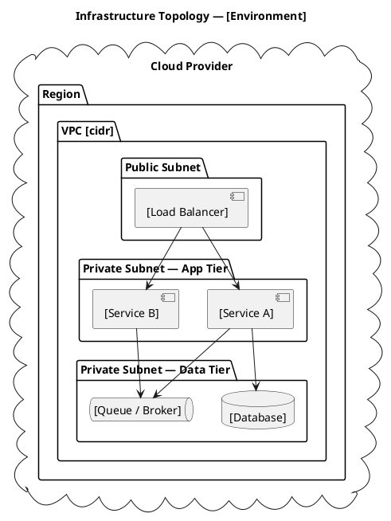

# Infrastructure Topology

<!--
  Canonical description of the infrastructure resource graph.
  Covers all environments — the environment promotion path defines how resources
  move from dev through staging to production.

  Update when:
  - A new region, VPC, subnet, or service is added or removed
  - Environment promotion path changes
  - Network topology or peering changes
  - A resource is migrated to a different tier or zone
-->

## Resource Inventory

| Resource | Type | Environment | Region / Zone | Managed by | Notes |
|---|---|---|---|---|---|
| `[resource-name]` | [VPC / Subnet / Instance / DB / LB / Queue / …] | [dev / staging / prod] | [region] | [Terraform module path] | [Notes] |

---

## Environment Promotion Path

```
dev  →  staging  →  prod
```

| Stage | Purpose | Promotion trigger | Approval required |
|---|---|---|---|
| dev | Active development, ephemeral resources | On every merge to `main` | No |
| staging | Pre-production validation | Manual promotion after QA sign-off | No |
| prod | Live traffic | Manual promotion after staging sign-off | Yes — [team/role] |

---

## Resource Graph



---

## Secrets and Credential Sources

| Secret | Source | Rotation cadence | Owner |
|---|---|---|---|
| `[SECRET_NAME]` | [Vault / SSM / Secrets Manager / env var] | [period or manual] | [team] |

---

## Known Constraints

- [e.g. Cross-region latency: service A and DB must be in the same region]
- [e.g. Prod DB is single-AZ — failover is manual]
