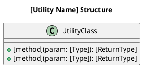

# module-data-flow.md

## Rules

* This file acts as the module flow index and rule definition.
* Do not put module flows in this file.
* Each module must have its own flow file.
* Each module flow file must follow the rules and format defined in this document.

### Implementation Flow Rules

* After implementation, update the matching module flow file with actual function names and file paths.
* If no matching implementation flow exists, create one.
* Each module flow file must include a class block describing the code structure.
* After writing: edit the ```plantuml block in the file, then run build_pdf.py to rebuild PDF

### Index Verification Rule

After creating or updating any module flow file, you MUST:
1. Open `docs/modules/module-data-flow.md`
2. Read the Module Flow Files table at the bottom
3. Verify the current module has a row in the table
4. If the row is missing, add it before moving on

Do not assume the row exists. Do not rely on memory. Read the file and check.

---

## Module Types

Every module must be classified as one of:

| Type | Description | What to document |
|---|---|---|
| **Feature** | Has an entry point that handles requests or commands — HTTP, GraphQL, CLI, RPC, WebSocket, etc. | Entry point → internal layers → data sink. Use the operations that apply (CRUD or equivalent). |
| **Background Job** | Runs outside the request cycle — queue consumer, cron, event handler, worker | Trigger → processing steps → success/failure path |
| **Pipeline Stage** | Consumes an upstream dataset or artifact, transforms or validates it, and produces a downstream dataset or artifact. Used in Data Pipeline and ML Pipeline projects. | Input contract → processing logic → output contract → error/skip path |
| **Shared Utility** | No entry point of its own — called by other modules | Class block only, no flow needed |

**Background Job vs Pipeline Stage:** use Background Job when the module's primary concern is responding to an event or message. Use Pipeline Stage when the module's primary concern is transforming or validating data as part of a larger data flow — the distinguishing question is "does this module have an upstream data contract and a downstream data contract?"

Declare the type at the top of every module flow file:

```
Module type: Feature | Background Job | Shared Utility
```

---

## Format A — Feature Module

Use this format for any module that has an entry point which receives a request or command
and returns a result. This includes — but is not limited to:

- REST / HTTP (Controller → Service → Repository)
- GraphQL (Resolver → UseCase → Model)
- CLI command (Command → Handler → Store)
- RPC / gRPC (Handler → Domain → Adapter)
- WebSocket message (Gateway → Service → Repository)
- Any other request-driven pattern

### What to document

Do not prescribe which layers exist — use whatever layers your architecture actually has.
The goal is to trace the path from entry point to data, with real function names and file paths.

For each operation, record:
1. **What triggers it** — user action, HTTP call, CLI command, message, etc.
2. **Each layer it passes through** — name the layer by what it actually does in your project
3. **Where data is read from or written to** — DB, cache, external API, file system, etc.
4. **What is returned or emitted**

### Operation Rules

Document every operation the module supports. Common operations:

| Pattern | Typical operations |
|---|---|
| CRUD (REST, ORM-based) | Create, Read/List, Read Detail, Update, Delete |
| Command/Query (CQRS) | Each command, each query |
| GraphQL | Each resolver |
| CLI | Each subcommand |
| WebSocket | Each message type handled |

If an operation is not supported, explicitly mark it as **Not Supported** — do not omit it silently.

### Flow Format

Name the steps after what they actually are in your project.
Do not use placeholder names like "Controller" or "Service" if your project calls them something else.

```
[Operation Name]

[Entry point — e.g., User submits form / HTTP POST / CLI command / incoming message]
↓
[Layer name as it exists in your project]
Function: actualFunctionName()
File: path/to/file
↓
[Next layer]
Function: actualFunctionName()
File: path/to/file
↓
[Data access — DB query / cache read / external API call / file read]
↓
[Result — response / return value / emitted event / side effect]
```

**Step naming — use whatever fits your architecture:**

The step label should match what the layer is actually called or does.
These are examples, not a fixed list:

| If your project uses… | Use that name |
|---|---|
| Controller / Handler / Router | Controller / Handler / Router |
| Service / UseCase / Domain / Application | Service / UseCase / Domain |
| Repository / Store / DAO / Adapter / Gateway | Repository / Store / DAO |
| Resolver / Query / Mutation | Resolver / Query / Mutation |
| Middleware / Interceptor / Filter | Middleware / Interceptor |
| Model / ActiveRecord | Model |
| Presenter / Serializer / DTO mapper | Presenter / Serializer |

Other valid step types (use when they exist in your flow):

- Frontend Component / Page / View
- Hook / Store / State
- API Client / HTTP Layer
- Cache Read / Cache Write
- External API Call
- Publish Event / Emit Message
- File Read / File Write
- Response / Return Value / Side Effect

Only include steps that actually exist in the flow. Do not add layers to match a template.

### Class Block Format (Feature)

Use real class / function names from your project.
The relationships should reflect actual dependencies, not an assumed layering.

```plantuml
@startuml
title [Module Name] Structure

class [YourEntryPointClass] {
  +[method](param: [Type]): [ReturnType]
  +[method](param: [Type]): [ReturnType]
}

class [YourNextLayerClass] {
  +[method](input: [Type]): [ReturnType]
  -[privateMethod](param): [Type]
}

class [YourDataLayerClass] {
  +[method](id: [Type]): [ReturnType]
  +[method](input: [Type]): [ReturnType]
}

[YourEntryPointClass]  --> [YourNextLayerClass]  : [relationship]
[YourNextLayerClass]   --> [YourDataLayerClass]   : [relationship]
@enduml
```

---

## Format B — Background Job / Queue Consumer

Use this format for modules that run outside the request cycle.
This includes: queue consumers, cron jobs, event handlers, workers, schedulers.

### What to document

1. **What triggers it** — queue message, cron schedule, event bus, manual trigger
2. **Entry point** — the function or class that receives the trigger
3. **Processing steps** — with real function names and file paths
4. **Success path** — acknowledge, commit, emit follow-up event
5. **Failure path** — retry strategy, dead-letter, alerting

### Flow Format

```
[Flow Name — e.g., Process OrderCreated Event / Daily Inventory Sync]

Trigger: [queue message / cron schedule "0 * * * *" / event bus / etc.]
↓
[Queue setup / Scheduler registration / Event subscription]
File: path/to/setup
↓
[Entry point — consumer / handler / job function]
Function: actualFunctionName()
File: path/to/entry
↓
[Pre-processing — e.g., message validation, idempotency check]
Function: actualFunctionName()
File: path/to/file
↓
[Processing steps — use real layer names from your project]
Function: actualFunctionName()
File: path/to/file
↓
[Data access]
↓
[On success] → [acknowledge / commit / emit follow-up]
[On failure] → [reject / retry / dead-letter]
```

**Step types for Background Jobs:**

- Queue Message / Cron Schedule / Event / Webhook ← always the entry trigger
- Consumer Entry / Job Entry / Handler Entry
- Idempotency Check
- Message Validation
- [Your processing layers — same naming rules as Format A]
- External API Call
- Publish Follow-up Event / Emit Side Effect
- Message Acknowledge / Commit (success)
- Message Reject / Dead-letter (failure)
- Retry Logic

### Error Handling (required for every Background Job flow)

```
Error Handling:
- Transient failure (e.g., DB timeout, external API down): [retry strategy]
- Permanent failure (e.g., malformed message, business rule violation): [dead-letter / discard strategy]
- Alerting: [how failures are surfaced — log level, notification channel]
```

### Class Block Format (Background Job)

```plantuml
@startuml
title  [Job Name] Structure

class [YourConsumerOrJobClass] {
  +[handleMethod](trigger: [TriggerType]): [ReturnType]
  -[validateMethod](payload): boolean
}

class [YourProcessingClass] {
  +[method](input: [Type]): [ReturnType]
}

[YourConsumerOrJobClass] --> [YourProcessingClass]: [relationship]
@enduml
```

---

## Format D — Pipeline Stage

Use this format for modules in Data Pipeline or ML Pipeline projects that consume an upstream
dataset or artifact and produce a downstream dataset or artifact.

### What to document

1. **Input contract** — where data comes from, what format, what naming convention, schema
2. **Processing steps** — validation logic, transformation logic, model inference, or metadata push
3. **Output contract** — where data goes, what format, what naming convention, schema or artifact type
4. **Error / skip path** — what happens when input is missing, invalid, or downstream is unavailable

### Flow Format

```
[Stage Name — e.g., GE Validation Gate / dbt Transformation / DataHub Ingest]

Input:
  Source: [file path / table name / topic / upstream stage output]
  Format: [CSV / Parquet / SQL table / JSON / model artifact]
  Naming: [e.g., data/raw/<source>_transactions.csv]
  Schema: [field names and types — or reference to pipeline-contract.md or data-model.md]
↓
[Pre-processing or validation step]
Function: actualFunctionName()
File: path/to/file
↓
[Core processing step]
Function: actualFunctionName()
File: path/to/file
↓
[On success]
Output:
  Destination: [file path / table name / topic / metadata aspect]
  Format: [CSV / SQL table / metadata aspect]
  Naming: [e.g., mart.mart_finance__net_revenue / data/archive/<run-id>/]
  Lifecycle: [Consumed and archived / Persisted / Overwritten / Immutable append]
↓
[On error / skip]
  [Input retained for retry / Input quarantined / Stage skipped non-blocking / Pipeline halted]
```

**Step naming for Pipeline Stages:**

| Step type | Use when |
|---|---|
| Input Contract | Always first — describes what this stage expects |
| Schema Validation | Input schema is checked before processing |
| Idempotency Check | Stage detects and skips already-processed inputs |
| Data Quality Gate | Quality checks that halt downstream on failure |
| Transformation | Data is reshaped, enriched, or aggregated |
| Model Inference | ML model is called to generate predictions |
| Metadata Push | Lineage, quality scores, or catalog entries are written |
| Archive / Lifecycle | Input files are moved or marked consumed |
| Output Contract | Always last — describes what this stage produces |

### Error Handling (required for every Pipeline Stage flow)

```
Error Handling:
- Missing input: [Stage waits / fails immediately / skips with log]
- Invalid input (schema / quality): [Stage fails, input retained / input quarantined to <path>]
- Processing error (transient): [retry strategy]
- Downstream unavailable: [non-blocking — log and skip / blocking — retry N times then fail]
- Alerting: [log level, notification channel]
```

### Class Block Format (Pipeline Stage)

```plantuml
@startuml
title [Stage Name] Structure

class [YourStageClass] {
  +[runMethod](input: [InputType]): [OutputType]
  -[validateMethod](data): boolean
  -[transformMethod](data): [IntermediateType]
}

class [YourOutputWriterClass] {
  +[writeMethod](output: [OutputType]): void
}

[YourStageClass] --> [YourOutputWriterClass] : produces

note bottom of [YourStageClass]
  InputType / OutputType must match
  the contracts defined in pipeline-contract.md
end note
@enduml
```

---

## Format C — Shared Utility

Use this format for modules that are used by other modules but have no entry point of their own.

### Rules

* No flow diagram required — shared utilities have no entry point.
* A class block is required to document the public interface.
* List which modules use this utility and for what purpose.

### Class Block Format (Shared Utility)



**Used by:**

| Module | Purpose |
|---|---|
| [module name] | [what it uses from this utility] |

---

## Module Flow Files

Each module has its own subfolder under `docs/modules/`.

Folder and file naming convention:
```
docs/modules/
├── module-data-flow.md              ← this index file
├── [module-name]/
│   ├── [module-name]-module-data-flow.md
│   └── log-[module-name].md
```

Examples:
```
docs/modules/order/order-module-data-flow.md                        ← Feature (REST)
docs/modules/checkout/checkout-module-data-flow.md                  ← Feature (GraphQL)
docs/modules/report-cli/report-cli-module-data-flow.md              ← Feature (CLI)
docs/modules/order-consumer/order-consumer-module-data-flow.md      ← Background Job
docs/modules/cron-inventory/cron-inventory-module-data-flow.md      ← Background Job
docs/modules/ge-validation/ge-validation-module-data-flow.md        ← Pipeline Stage
docs/modules/dbt-transform/dbt-transform-module-data-flow.md        ← Pipeline Stage
docs/modules/model-training/model-training-module-data-flow.md      ← Pipeline Stage
docs/modules/email-sender/email-sender-module-data-flow.md          ← Shared Utility
```

Files matching `*-module-data-flow.md` are automatically included in the PDF.

| Module | Type | Folder | Flow file |
|---|---|---|---|
| [e.g., Order] | Feature | `docs/modules/order/` | `order-module-data-flow.md` |
| [e.g., Order Consumer] | Background Job | `docs/modules/order-consumer/` | `order-consumer-module-data-flow.md` |
| [e.g., GE Validation] | Pipeline Stage | `docs/modules/ge-validation/` | `ge-validation-module-data-flow.md` |
| [module] | [type] | `docs/modules/[module]/` | `[module]-module-data-flow.md` |
