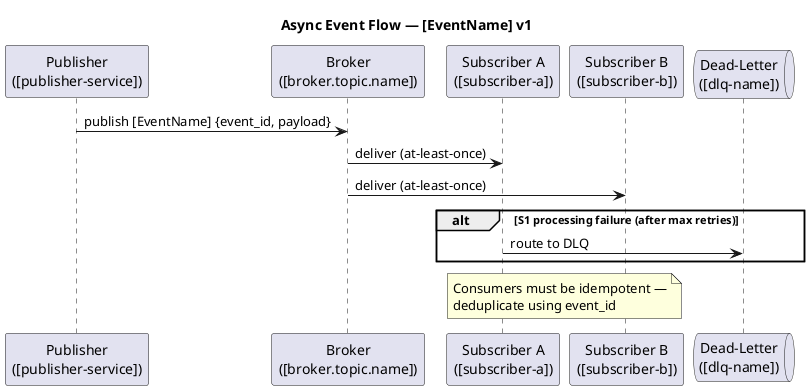

# Event Catalog

<!--
  Canonical source for all async messaging contracts.
  Covers events published via Kafka, RabbitMQ, SQS, Pub/Sub, or similar brokers.
  Decoupled from service-contract.md (synchronous REST between services)
  and from api-contract.md (client-facing external API).

  Update when:
  - A new event type is added or retired
  - A payload schema changes (field added, removed, or type changed)
  - A publisher or subscriber changes
  - Retention or dead-letter policy changes
  - Schema evolution rules change
-->

## Event Inventory

| Event | Version | Publisher | Subscriber(s) | Broker / Topic | Status |
|---|---|---|---|---|---|
| `[EventName]` | v1 | [publisher-service] | [subscriber-a], [subscriber-b] | `[broker.topic.name]` | Active |

---

## Event Definitions

### [EventName]

**Version:** v1
**Publisher:** [publisher-service]
**Subscriber(s):** [subscriber-a], [subscriber-b]
**Broker / Topic:** `[broker.topic.name]`
**Status:** Active

#### Payload Schema

| Field | Type | Required | Description |
|---|---|---|---|
| `event_id` | string (UUID) | ✅ | Unique event ID — consumers use for deduplication |
| `event_type` | string | ✅ | Always `"[EventName]"` |
| `schema_version` | string | ✅ | Always `"1"` for this version |
| `timestamp` | string (ISO 8601) | ✅ | UTC timestamp when the event was emitted |
| `[field]` | [type] | ✅ / ⚠️ | [Description] |

Example payload:
```json
{
  "event_id": "550e8400-e29b-41d4-a716-446655440000",
  "event_type": "[EventName]",
  "schema_version": "1",
  "timestamp": "2024-01-15T10:30:00Z",
  "[field]": "[value]"
}
```

#### Retention Policy

Retention: [N days]
Max delivery retries: [N] (backoff: [e.g. 1s, 5s, 30s])

#### Dead-Letter Policy

Dead-letter queue / topic: `[dlq-name]`
Routed after: [N] failed delivery attempts
Alert: [e.g. PagerDuty alert when DLQ depth > 10]

#### Schema Evolution Rules

- **Allowed without version bump:** adding optional fields with safe defaults
- **Requires version bump:** removing fields, changing field types, changing field semantics
- **Deprecation:** mark field as `deprecated` in this file for one release cycle before removing

---

## Sequence Diagram



---

## Cross-Service Consistency Rules

1. **event_id** — every event must include a UUID `event_id`; consumers must not process the same `event_id` twice.
2. **Idempotency** — all subscribers must be idempotent with respect to `event_id`.
3. **schema_version** — consumers must check `schema_version` and reject unknown versions gracefully (log + route to DLQ; do not crash).
4. **Service Contract alignment** — if an event is also referenced in `service-contract.md`, this file is the canonical schema source; `service-contract.md` references this file, not the reverse.
