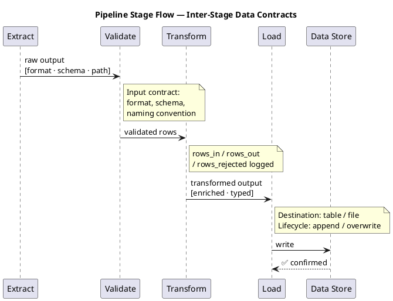

# Pipeline Contract

<!--
  For: Data Pipeline, ML Pipeline projects
  Replaces: api-contract.md (pipelines have no HTTP endpoints)
  Purpose: Documents every inter-stage data contract — what each stage consumes,
           what it produces, and what happens on failure.
  Update when: A stage's input or output format, path, naming rule, or lifecycle changes.
-->

## Overview

| Stage | Input | Output | Trigger |
|---|---|---|---|
| [Stage name] | [File / table / stream] | [File / table / metadata] | [Cron / file drop / upstream stage] |

---

## Stage Contracts

Repeat this block for each pipeline stage.

---

### [Stage Name]

**Type:** File drop / Database table / Message / API call / Artifact

**Trigger:** [How this stage is started — cron, file sensor, upstream stage success, manual]

#### Input Contract

| Property | Value |
|---|---|
| Source | [Path, table name, topic, or API endpoint] |
| Format | [CSV / Parquet / JSON / Avro / SQL table / etc.] |
| Naming convention | [e.g., `<source>_transactions.csv`, `raw.<table>`, `topic-name`] |
| Schema | [Field names and types — or reference to data-model.md] |
| Presence guarantee | [Always present / may be absent — describe what happens if absent] |

#### Output Contract

| Property | Value |
|---|---|
| Destination | [Path, table name, topic, or downstream service] |
| Format | [CSV / Parquet / JSON / SQL table / metadata aspect / etc.] |
| Naming convention | [e.g., `mart.<table>`, `data/archive/<run-id>/<file>`] |
| Schema | [Field names and types — or reference to data-model.md] |
| Lifecycle | [Consumed and archived / Persisted / Overwritten / Immutable append] |

#### Error / Skip Handling

| Scenario | Behaviour |
|---|---|
| Input missing or empty | [Stage waits / fails / skips] |
| Input fails validation | [Stage fails, input retained for retry / input quarantined] |
| Processing error | [Retries N times, then fails / alerts and halts] |
| Downstream unavailable | [Non-blocking — logged and skipped / Blocking — retried] |

#### Negative Test

List the test data file or scenario used to verify this contract's error path.

- [ ] Scenario: [description]
  - Test data: [path or description]
  - Expected: [stage result — failed / skipped / alerted]
  - Verified: [date and actual result]

---

## Cross-Stage Consistency Check

Run this check whenever any stage contract changes.

For each field or file that crosses a stage boundary:

| Field / File | Produced by | Consumed by | Format match? | Verified |
|---|---|---|---|---|
| [field name or file path] | [stage] | [stage] | ✅ / ❌ | [date] |

A mismatch between produced and consumed format is a **High** finding.
Do not proceed to the next stage's implementation until the mismatch is resolved.
