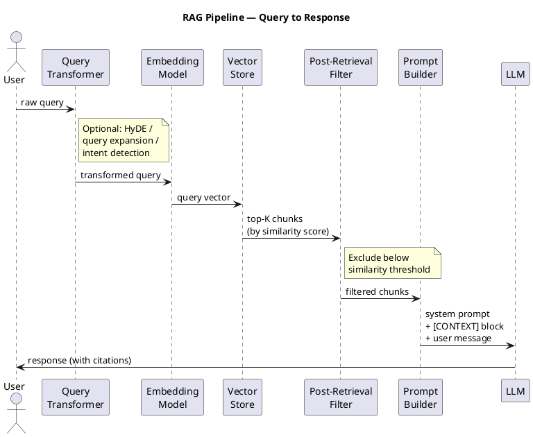

# RAG Contract

<!--
  For: AI / LLM Application (optional — only when Retrieval-Augmented Generation is used)
  Purpose: Documents the retrieval pipeline: knowledge sources, chunking strategy,
           embedding model, vector store, and how retrieved context is injected into prompts.
  Update when: A new knowledge source is added, chunking or embedding strategy changes,
               similarity threshold is tuned, or retrieval quality issues are found.
-->

## Knowledge Sources

| Source | Type | Update frequency | Format |
|---|---|---|---|
| [e.g., Financial news feed] | [API / file / DB query] | [real-time / daily / manual] | [JSON / PDF / plain text] |
| [e.g., Personal investment records] | [CSV / DB] | [on upload] | [CSV] |

---

## Chunking Strategy

| Property | Value | Rationale |
|---|---|---|
| Chunk size | [e.g., 512 tokens] | [why — e.g., balances context vs precision] |
| Overlap | [e.g., 64 tokens] | [prevents context loss at boundaries] |
| Splitter | [e.g., RecursiveCharacterTextSplitter / sentence splitter] | |
| Metadata attached | [e.g., source name, date, section title] | [used for filtering and citation] |

---

## Embedding Model

| Property | Value |
|---|---|
| Model | [e.g., text-embedding-3-small, voyage-finance-2] |
| Provider | [OpenAI / Anthropic / local] |
| Dimensions | [e.g., 1536] |
| Re-embedding trigger | [e.g., on source update / when model changes] |

---

## Vector Store

| Property | Value |
|---|---|
| Store | [e.g., Chroma, Pinecone, pgvector, FAISS] |
| Index type | [e.g., HNSW, IVFFlat] |
| Similarity metric | [cosine / dot product / L2] |
| Similarity threshold | [e.g., 0.75 — below this, result is excluded] |
| Top-K retrieved | [e.g., 5 chunks per query] |

---

## Retrieval Flow



---

## Context Injection Format

How retrieved chunks are formatted before injecting into the prompt:

```
[CONTEXT]
Source: {{source_name}} ({{date}})
{{chunk_text}}

Source: {{source_name}} ({{date}})
{{chunk_text}}
[/CONTEXT]
```

---

## Failure Handling

| Scenario | Behaviour |
|---|---|
| No chunks above threshold | [Proceed without context / inform user retrieval failed / refuse to answer] |
| Vector store unavailable | [Fallback: answer from model knowledge only / surface error] |
| Stale index (source updated but not re-embedded) | [Log warning / flag in response] |
