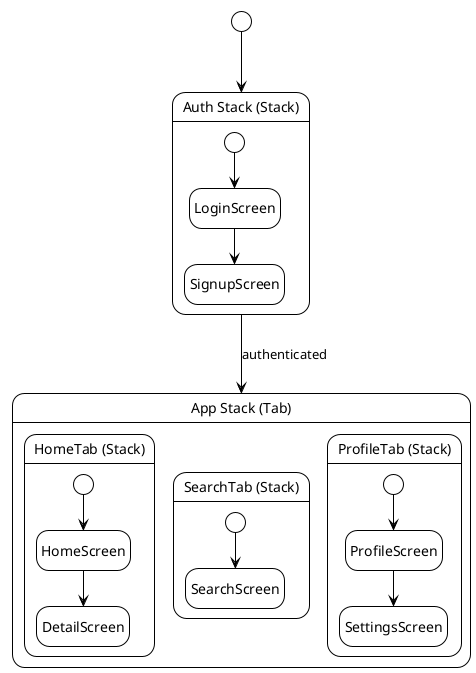

# Mobile Contract

<!--
  For: Mobile App projects (React Native, Flutter, iOS/Swift, Android/Kotlin)
  Purpose: Screen inventory, navigation graph, deep-link scheme,
           OS permission declarations, and push notification payloads.
  Update when: A new screen is added or removed, navigation structure changes,
               a new OS permission is required, or push notification payload changes.
-->

## App Identity

| Property | Value |
|---|---|
| App name (display) | [e.g., MyApp] |
| Bundle ID / App ID | [e.g., com.example.myapp] |
| Framework | [React Native / Flutter / SwiftUI / Jetpack Compose] |
| Platforms | [iOS / Android / both] |
| Min OS version | iOS [X.X] / Android API [XX] |

---

## Screen Inventory

| Screen name | Route / path | Auth required | Description |
|---|---|---|---|
| [HomeScreen] | `/home` | Yes | [Main dashboard] |
| [LoginScreen] | `/login` | No | [Credential entry] |
| [ProfileScreen] | `/profile` | Yes | [User profile view and edit] |
| [SettingsScreen] | `/settings` | Yes | [App preferences] |

---

## Navigation Graph

<!--
  Show the screen transition structure using a state diagram.
  Stack = push/pop (back button). Tab = peer screens. Modal = overlays top of stack.
  Use the navigator types actually used in this project (StackNavigator, TabNavigator, etc.).
  Add or remove state blocks to match your actual screen hierarchy.
-->



---

## Deep Link Scheme

| Deep link URL | Target screen | Parameters | Notes |
|---|---|---|---|
| `myapp://home` | HomeScreen | — | Opens main dashboard |
| `myapp://item/:id` | DetailScreen | `id: string` | Opens specific item |
| `https://myapp.com/share/:id` | ShareScreen | `id: string` | Universal link for sharing |

**Scheme name:** `myapp://`
**Universal link domain:** `[myapp.com]` (if configured)

---

## OS Permission Declarations

| Permission | Platform | When requested | Required / Optional | Reason shown to user |
|---|---|---|---|---|
| Camera | iOS + Android | On first photo upload | Optional | "To let you upload profile photos" |
| Push Notifications | iOS + Android | After first login | Optional | "To send you order updates" |
| Location (when in use) | iOS + Android | On map feature first use | Optional | "To show nearby results" |
| Photo Library | iOS | On profile photo upload | Optional | "To select a photo from your library" |

**iOS:** declare all permissions in `Info.plist` with usage description strings.
**Android:** declare all permissions in `AndroidManifest.xml`.

---

## Push Notification Payloads

### [notification-type-1] Notification

**Trigger:** [e.g., order status update from backend]

```json
{
  "notification": {
    "title": "Your order is on the way",
    "body": "Order #1234 has shipped"
  },
  "data": {
    "type": "order_update",
    "order_id": "1234",
    "status": "shipped",
    "deep_link": "myapp://orders/1234"
  }
}
```

**Handling:** Tap opens DetailScreen for `order_id`. Background: update order status badge.

---

### [notification-type-2] Notification

**Trigger:** [e.g., chat message received]

```json
{
  "notification": {
    "title": "[Sender name]",
    "body": "[Message preview — max 50 chars]"
  },
  "data": {
    "type": "chat_message",
    "thread_id": "[thread-id]",
    "deep_link": "myapp://chat/[thread-id]"
  }
}
```

**Handling:** Tap opens ChatScreen for `thread_id`. Background: increment badge count.

---

## App Store / Play Store Metadata

| Field | iOS (App Store) | Android (Google Play) |
|---|---|---|
| Category | [Utilities / Social / etc.] | [Tools / Communication / etc.] |
| Age rating | [4+ / 12+ / 17+] | [Everyone / Teen / Mature] |
| In-app purchases | [Yes / No] | [Yes / No] |
| Privacy policy URL | [URL] | [URL] |

---

## Platform-Specific Notes

### iOS

- **Signing:** Distribution certificate + provisioning profile required for App Store build
- **App Transport Security:** [List any ATS exceptions in Info.plist]
- **Background modes:** [e.g., Background fetch, Remote notifications — if used]

### Android

- **Signing:** Keystore required; `upload-keystore.jks` stored in [location, never in git]
- **Target SDK:** API [XX] (must be current Play Store requirement)
- **Proguard / R8:** [Enabled / Disabled]; rules in `proguard-rules.pro`

---

## Non-Functional Requirements

| Metric | Requirement |
|---|---|
| Cold start time | App fully interactive within [e.g., 2s] on mid-range device |
| Frame render time | Target 60 fps — no frame should take > 16ms |
| API call user-facing latency | Show loading indicator after [e.g., 300ms]; full response < [e.g., 3s] |
| Offline usability | [Core features work offline / Read-only offline / Online only] |
| App size (install) | < [e.g., 50MB] on iOS; < [e.g., 30MB] on Android |
| Background battery usage | No background network polls more frequent than [e.g., 15 min] |

---

## Edge Cases

| Scenario | Expected behaviour |
|---|---|
| No network connectivity on launch | Show offline banner; load cached data; queue write actions for retry |
| Network lost mid-API call | Retry once after reconnect; show toast "Connection lost" |
| Push notification permission denied by user | Skip notification sending; do not re-prompt after initial denial |
| Deep link to deleted or inaccessible resource | Redirect to home screen with toast "Item no longer available" |
| App backgrounded mid-form-fill | Persist draft to local storage; restore automatically on foreground |
| Authentication token expires while app is open | Auto-refresh silently; if refresh fails, redirect to login screen |
| Device storage full on write | Show error before write; never crash; suggest clearing cache |
| OS permission revoked while app is running | Detect on next feature use; show permissions dialog (not a crash) |
| App killed by OS (memory pressure, low RAM) | On next launch, restore to last-visited screen |
| Large list with thousands of items | Use virtualized list (FlatList / ListView) — never render all at once |

> *Add screen-specific edge cases next to their navigation nodes above.*
